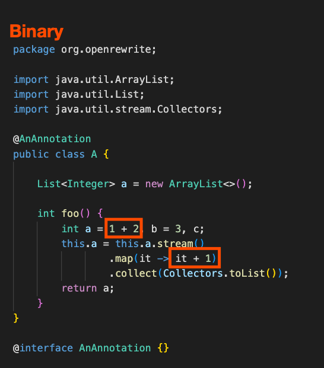
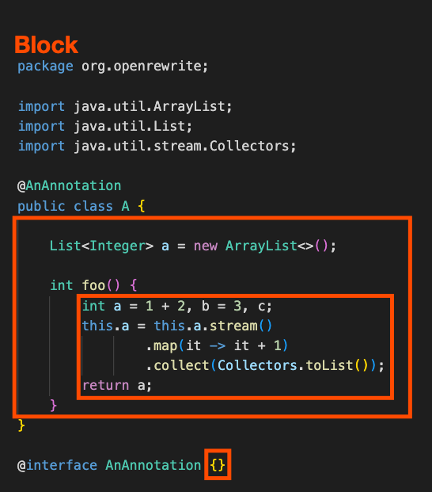

# Java LST examples

When building recipes, it's important to understand how OpenRewrite [Lossless Semantic Trees](lossless-semantic-trees.md) (LSTs) correspond to code. You couldn't, for example, properly rename a variable with a recipe unless you knew that [J.Identifier](https://github.com/openrewrite/rewrite/blob/v7.33.0/rewrite-java/src/main/java/org/openrewrite/java/tree/J.java#L2310-L2343) is the class used to represent a variable.

To help you get started on working with Java LSTs and OpenRewrite, this guide will:

* [Explain how LSTs work at a high-level](lst-examples.md#high-level-lst-explanation)
* [Provide a high-level diagram that shows how LSTs relate to each other](lst-examples.md#lst-diagram)
* [Provide a sample chunk of code and discuss how that code relates to different types of LSTs](lst-examples.md#java-lst-types)
* [Teach you how to learn more about LSTs yourself](lst-examples.md#using-the-debugger-to-detect-lsts)

## High-level LST explanation

In order to programmatically modify code without risking the introduction of syntactic or semantic errors, you must use a data structure that can accurately and comprehensively represent said code. OpenRewrite uses [Lossless Semantic Trees](lossless-semantic-trees.md) (LSTs) for this purpose. Like other tree data structures, more complex LSTs are recursively composed of other, simpler LSTs.

For instance, a [ClassDeclaration](lst-examples.md#classdeclaration) is an LST that defines a class. A typical class declaration will be composed of elements such as fields, methods, constructors, and inner classes. Each of those elements are, themselves, an LST. So the term "LST" may refer to an entire, complete Java file or just one piece of it.

It's important to note that it is possible to manipulate LSTs to create code that will not compile. While OpenRewrite provides some safeguards against grammatically invalid transformations in its type system (such as not allowing import statements to be replaced with a method declaration), it is still possible to write code that is valid according to the Java grammar without being a valid, compilable program.

For example, nothing prevents you from modifying an LST so that a variable is used before it is defined. It is the responsibility of recipe authors to consider language semantics and the full range of possibilities when making changes. In accordance with the principle of [Doing No Harm](../authoring-recipes/recipe-conventions-and-best-practices.md#do-no-harm), always err on the side of leaving code untouched rather than making a risky change.

## LST diagram

This diagram demonstrates how a simple Java class is represented as an LST. Note the hierarchical structure where LSTs are composed out of other LSTs.

<figure><figcaption></figcaption></figure>

## Java LST types

Below is a simple Java class whose entire purpose is to demonstrate different types of LSTs. Each of the following sections will highlight different parts of this code to demonstrate which chunks correspond to which LST. This listing of LST types is not exhaustive but should give you a good sense of the most common types.

```java
package org.openrewrite;
                
import java.util.ArrayList;
import java.util.List;
import java.util.stream.Collectors;

@AnAnnotation
public class A {

    List<Integer> a = new ArrayList<>();

    int foo() {
        int a = 1 + 2, b = 3, c;
        this.a = this.a.stream()
                .map(it -> it + 1)
                .collect(Collectors.toList());
        return a;
    }
}

@interface AnAnnotation {}
```

### Binary

A [Binary](https://github.com/openrewrite/rewrite/blob/v7.33.0/rewrite-java/src/main/java/org/openrewrite/java/tree/J.java#L597-L705) is an [Expression](lst-examples.md#expression) with a left and right side, separated by an operator. Examples of operators include `+`, `-`, `||`, `&&`, and more.



### Block

A [Block](https://github.com/openrewrite/rewrite/blob/v7.33.0/rewrite-java/src/main/java/org/openrewrite/java/tree/J.java#L712-L851) is a pair of curly braces and the [Statements](lst-examples.md#statement) contained within. Blocks can be nested inside of each other.



### ClassDeclaration

A [ClassDeclaration](https://github.com/openrewrite/rewrite/blob/v7.33.0/rewrite-java/src/main/java/org/openrewrite/java/tree/J.java#L1062-L1336) contains all of the code for any Java class. Please note that a `ClassDeclaration` can be nested inside of another class such as with:

```java
public class A {
    // ...
    private class B {
        // ...
    }
}
```


### CompilationUnit

A [CompilationUnit](https://github.com/openrewrite/rewrite/blob/v7.33.0/rewrite-java/src/main/java/org/openrewrite/java/tree/J.java#L1342-L1545) is the root of the Java LST. In order for an LST to represent valid Java code, all other elements must be contained inside of this.


### Expression

An [Expression](https://github.com/openrewrite/rewrite/blob/v7.33.0/rewrite-java/src/main/java/org/openrewrite/java/tree/Expression.java) is anything that returns a value. `MethodInvocation`, `Identifier`, and `Binary` are all examples of expressions. Please note that some LSTs such as `MethodInvocation` are both a [Statement](lst-examples.md#statement) and an Expression.

In the below code, only some of the expressions are highlighted as expressions can often have many expressions inside of them and it would be too difficult to read if all of them were highlighted. For instance, `import java.util.ArrayList` is many expressions (`java`, `util`, `ArrayList`, `java.util`, and `java.util.ArrayList`).


### FieldAccess

A [FieldAccess](https://github.com/openrewrite/rewrite/blob/v7.33.0/rewrite-java/src/main/java/org/openrewrite/java/tree/J.java#L1827-L1953) is any fully qualified name. Often times, these are package or import statements, but they can also appear in code as something like: `this.foo`.


### Identifier

An [Identifier](https://github.com/openrewrite/rewrite/blob/v7.33.0/rewrite-java/src/main/java/org/openrewrite/java/tree/J.java#L2310-L2343) is any name in the code (class names, variable names, method names, etc).

You can use `J.Identifier.getFieldType()` to tell what class the identifier is a field on. If `null` is returned, then that means the identifier it is not a field.


### MethodDeclaration

A [MethodDeclaration](https://github.com/openrewrite/rewrite/blob/v7.33.0/rewrite-java/src/main/java/org/openrewrite/java/tree/J.java#L3223-L3517) is the annotations, modifiers, return type, name, argument list, and body which together define a method on a [Class](lst-examples.md#classdeclaration).


### MethodInvocation

A [MethodInvocation](https://github.com/openrewrite/rewrite/blob/v7.33.0/rewrite-java/src/main/java/org/openrewrite/java/tree/J.java#L3523-L3694) consists of a select expression, any defined type parameters, the method name, and its arguments. Method invocations have a somewhat surprising structure where the highest-level LST element consists of the select expression (everything to the left of the last dot) and the name on the right. Let's use the below code as an example to clarify this further.


* In the above code, the "highest-level" `MethodInvocation` (`this.a.stream().map(it -> it + 1).collect(Collectors.toList())`) would have these components:
  * Select expression: `this.a.stream.map(it -> it + 1)`
  * Name: `collect`
  * A single argument: `Collectors.toList()`
* The argument passed into the above `MethodInvocation` (`Collectors.toList()`) is itself a `MethodInvocation` that would have these components:
  * Select expression: `Collectors`
  * Name: `toList`
  * No arguments
* The select expression of the highest-level `MethodInvocation` (`this.a.stream().map(it -> it + 1)`) is _also_ a `MethodInvocation` and it would have these components:
  * Select expression: `this.a.stream()`
  * Name: `map`
  * A single argument which is the lambda expression: `it -> it + 1`
* The select expression of the above `MethodInvocation` (`this.a.stream()`) is also a `MethodInvocation` that has these components:
  * Select expression: `this.a`
  * Name: `stream`
  * No arguments

### NewClass

A [NewClass](https://github.com/openrewrite/rewrite/blob/v7.33.0/rewrite-java/src/main/java/org/openrewrite/java/tree/J.java#L3996-L4158) is when an object is created via its constructors and the `new` keyword.


### Statement

A [Statement](https://github.com/openrewrite/rewrite/blob/v7.33.0/rewrite-java/src/main/java/org/openrewrite/java/tree/Statement.java) is anything that appears on its own line within a block. Statement elements are usually terminated with a semicolon. `if`, `while`, `try`, `Block`, `return`, and `MethodInvocation` are all examples of statements. Please note that some LST elements such as `MethodInvocation` are both Statements and [Expressions](lst-examples.md#expression).

In the below code, only some of the statements are highlighted as statements will often have many sub-statements and the diagram would become too difficult to read. For instance, `List<Integer> a = new ArrayList<>()` is a statement as well as `new ArrayList<>()`.


### VariableDeclarations

A [VariableDeclarations](https://github.com/openrewrite/rewrite/blob/v7.33.0/rewrite-java/src/main/java/org/openrewrite/java/tree/J.java#L5318-L5526) contains the declaration of one or more variables of the same type, with or without initializing expressions for each variable.


## Using the debugger to detect LSTs


If you want an easier and more visual way to examine LSTs, check out the [TreeVisitingPrinter guide](tree-visiting-printer.md).


If you find yourself still unsure what makes up a particular LST or if you want to traverse the LST yourself, you can use the Java debugger to help you.

Let's use the example code from above as an example. You can make a simple recipe that doesn't do much aside from visit a [CompilationUnit](lst-examples.md#compilationunit): [gist](https://gist.github.com/mike-solomon/0f9a171d0b444f3bb576f9cba2e5a304). You can then make a test that checks that the code hasn't changed: [gist](https://gist.github.com/mike-solomon/9e13ae5acb6c60effaf6557176771785).

Once you have that recipe and test class created, there are two main places where you'll want to add breakpoints:

* Inside of the `visitCompilationUnit` method in your recipe class OR
* Inside of the [JavaVisitor.java class itself](https://github.com/openrewrite/rewrite/blob/v7.33.0/rewrite-java/src/main/java/org/openrewrite/java/JavaVisitor.java).

If you add a breakpoint in the `visitCompilationUnit` method, you'll find that the entire LST is defined in a variable called `cu`. In there, you can see things like `classes` which is an `ArrayList` of `ClassDeclaration` elements. You could then expand the `classes` element and find a `body` that contains `statements` that contain `VariableDeclaration` and `MethodDeclaration` elements and so on:


If you add a breakpoint in the `JavaVisitor.java` class instead, you can pick which LST type you want to explore. For instance, if you wanted to see what a `ClassDeclaration` LST is in your code, you could add a breakpoint in the [visitClassDeclaration method](https://github.com/openrewrite/rewrite/blob/v7.33.0/rewrite-java/src/main/java/org/openrewrite/java/JavaVisitor.java#L410-L453). You'll now find that the LST begins with a `ClassDeclaration` instead of `CompilationUnit`. You can step through the tree in the same way as before and you'll find everything else is the same. The benefit of this approach is that you can continue to resume the program and it'll stop at every point in the LST that a `ClassDeclaration` is visited.


