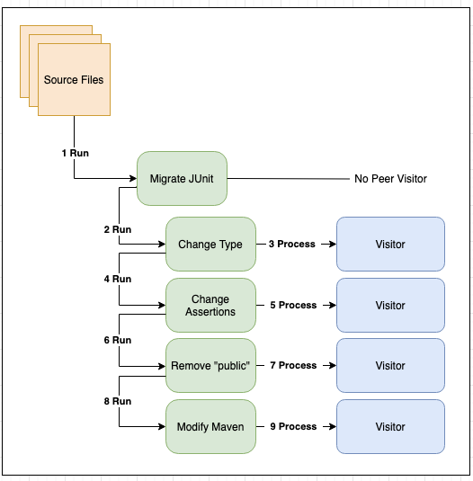

# Recipes

A recipe represents a group of search and refactoring operations that can be applied to a [Lossless Semantic Tree](./lossless-semantic-trees.md). A recipe can represent a single, stand-alone operation or it can be linked together with other recipes to accomplish a larger goal such as a framework migration.

OpenRewrite provides a managed environment for discovering, instantiating and configuring recipes. To implement a search or refactoring operation, a recipe delegates to a [visitor](./visitors.md) which handles the LST traversal and manipulation.

## Imperative Recipes

An imperative recipe is built by extending the `org.openrewrite.Recipe` class and injecting configuration properties via its constructor.

Let's look at a simple example where a Java recipe performs an operation to change all references of an original type to a new type:

```java
public class ChangeType extends Recipe {
    // Standard recipe description and name ...

    private final String oldFullyQualifiedTypeName;
    private final String newFullyQualifiedTypeName;

    // Recipe configuration is injected via the constructor
    @JsonCreator
    public ChangeType(
        @JsonProperty("oldFullyQualifiedTypeName") String oldFullyQualifiedTypeName, 
        @JsonProperty("newFullQualifiedTypeName") String newFullQualifiedTypeName
    ) {
        this.oldFullyQualifiedTypeName = oldFullyQualifiedTypeName;
        this.newFullQualifiedTypeName = newFullQualifiedTypeName;
    }

    @Override
    public TreeVisitor<?, ExecutionContext> getVisitor() {
        // Construct an instance of a visitor that will operate over the LSTs.
        return new ChangeTypeVisitor(oldFullyQualifiedTypeName, newFullyQualifiedTypeName);
    }

    // In many cases, the visitor is implemented as a private, inner class. This
    // ensures that the visitor is only used via its managed, configured recipe. 
    private class ChangeTypeVisitor extends JavaVisitor<ExecutionContext> {
        //...
    }

}
```

This recipe accepts two configuration parameters via its constructor. Recipes may be linked together with many other recipes and run in a variety of orders, contexts, and number of cycles. Making your recipes immutable, as this one is, is a strongly recommended best practice. Any mutable state should be local to the visitor, a fresh instance of which should be returned from each invocation of `getVisitor()`.

### Linking Recipes Together

Consider this non-exhaustive list of steps required to migrate a project from JUnit 4 to JUnit 5:

* Replace the annotation `org.junit.Test` with `org.junit.jupiter.api.Test`
* Change assertions from `org.junit.Assert` to `org.junit.jupiter.api.Assertions`, including updating the order of arguments within the method invocations
* Remove public visibility from test classes and methods that no longer need to be `public` in JUnit 5
* Modify the Maven `pom.xml` to include dependencies on JUnit 5, and remove dependencies on JUnit 4

No one recipe should be responsible for implementing all of these different responsibilities. Instead, each responsibility is handled by its own recipe and those recipes are aggregated together into a single "Migrate JUnit 4 to 5" recipe. The migration recipe has no behavior of its own except to invoke each of the building blocks. Recipes can add other recipes to the execution pipeline by overriding the `List<Recipe> getRecipeList()` function and returning an array of recipes that should be run.

In our above example, the "Migrate to JUnit 5" recipe could look similar to the following:

```java
package org.example.testing;

import org.openrewrite.java.ChangeType;

public class JUnit5Migration extends Recipe {
    // Standard recipes descriptions and names ...

    @Override
    public List<Recipe> getRecipeList() {
        return Arrays.asList(
            new ChangeType("org.junit.Test", "org.junit.jupiter.api.Test", false),
            new AssertToAssertions(),
            new RemovePublicTestModifiers()
        );
    }
}
```

Note that this recipe does not have an associated visitor of its own, instead relying on a group of other recipes to achieve the desired result. For a real recipe that uses this feature, check out the [UpdateMovedRecipe](https://github.com/openrewrite/rewrite/blob/v8.1.15/rewrite-java/src/main/java/org/openrewrite/java/recipes/UpdateMovedRecipe.java).

:::info
If you have a recipe that makes changes and you want to call another recipe, you can use the `doAfterVisit` method inside of your visitor. This will schedule another visit on the _current_ source file being visited with the recipe you specified. This is particularly useful for things like adding imports (which are at the top of the file) when you are deep in the file editing some method body.

For an example of a recipe that does this, check out the [AddManagedDependency recipe](https://github.com/openrewrite/rewrite/blob/v8.1.15/rewrite-maven/src/main/java/org/openrewrite/maven/AddManagedDependency.java#L202).
:::

## Declarative Recipes

Declarative recipes are defined in YAML and loaded as part of OpenRewrite's managed [Environment](./environment.md). A declarative recipe composes and configures other recipes via the OpenRewrite configuration file. In our above example, the declarative version of the "Migrate JUnit 5" recipe might look similar to the following:

```yaml
---
type: specs.openrewrite.org/v1beta/recipe
name: org.example.testing.JUnit5Migration
recipeList:
  - org.openrewrite.java.ChangeType:
      oldFullyQualifiedTypeName: org.junit.Test
      newFullyQualifiedTypeName: org.junit.jupiter.api.Test
  - org.example.testing.AssertToAssertions
  - org.example.testing.RemovePublicTestModifiers
  - org.example.testing.AddJUnitDependencies
```

:::info
Note that values passed to declarative recipes are subject to YAML interpretation. So `1.20` would be interpreted as a float, causing the trailing 0 to be dropped. Wrapping the value in single or double quotes will resolve this.
For more information on how to work with and use declarative recipes, please read our [Declarative YAML guide](../reference/yaml-format-reference.md).
:::

## Refaster Template Recipes

Refaster template recipes are used to replace one expression with another – or one statement with another. Because of that, they're ideal for straightforward replacements such as converting `StringUtils.equals(..)` to `Objects.equals(..)`. These are more than just a string replacement, though; they offer compiler and type support.

:::info
For more information on Refaster template recipes, please see our [Getting started with Refaster template recipes guide](../authoring-recipes/refaster-recipes.md) or our [documentation on the different types of recipes](../authoring-recipes/types-of-recipes.md).
:::

## Recipe Configuration & Validation

OpenRewrite provides a managed environment in which a set of recipes are executed. It will instantiate recipe instances and often inject configuration properties that have been defined within configuration files. The Recipe class exposes a `validate()` method that is called by the framework to determine whether all required configuration to a recipe has been supplied. The default implementation of `validate()` provides basic required/optional validation checks if a recipe's fields are annotated with `@NonNull`.

:::tip
The default logic will look for both package-level annotations (NonNullFields) and field-level annotations (NonNull, Nullable).
:::

In the event that a recipe requires custom validation rules different from the default behavior, a subclass can override `validate()` with an appropriate implementation.

### Recipe Descriptors

OpenRewrite provides facilities for documenting a recipe and its configurable properties via a contract on the Recipe class. A recipe author may document the name (via `Recipe.getDisplayName`) and its description (via `Recipe.getDescription`) to provide basic information about the recipe. Additionally, OpenRewrite provides an annotation, `org.openrewrite.Option` , that can be applied to the recipe's fields. Collectively, this metadata is used in automated documentation.

The following is an example of how to properly define the metadata on a recipe:

```java
public class ChangeType extends Recipe {

    @Option(displayName = "Old fully-qualified type name", description = "Fully-qualified class name of the original type.")
    String oldFullyQualifiedTypeName;

    @Option(displayName = "New fully-qualified type name", description = "Fully-qualified class name of the replacement type, the replacement type can also defined as a primitive.")
    String newFullyQualifiedTypeName;

    @Override
    public String getDisplayName() {
        return "Change type";
    }

    @Override
    public String getDescription() {
        return "Change a given type to another.";
    }

    //...
}
```

There are a few recommended best practices when defining metadata for a recipe:

* Sentence-case descriptions (capitalize only the first letter of the first word)
* Use back-ticks (\`\`) around terms representing code as these will be rendered in Markdown in any context where rich text is available
* Ensure the description ends with a period

## Scanning Recipes

If a recipe needs to generate new source files or needs to see all source files before making changes, it must be a `ScanningRecipe`.
A `ScanningRecipe` extends the normal `Recipe` and adds two key objects: an [accumulator](https://github.com/openrewrite/rewrite/blob/v8.1.1/rewrite-core/src/main/java/org/openrewrite/ScanningRecipe.java#L88-L90) and a [scanner](https://github.com/openrewrite/rewrite/blob/v8.1.1/rewrite-core/src/main/java/org/openrewrite/ScanningRecipe.java#L53). 
The `accumulator` object is a custom data structure defined by the recipe itself to store any information the recipe needs to function.
The `scanner` object is a `visitor` which populates the `accumulator` with data.

Scanning recipes may not be used as preconditions for declarative YAML recipes.

Scanning recipes have three phases:

1. A scanning phase that collects information while making no new code changes. In this phase, the `scanner` is called for each source file and information is added to the `accumulator` that the recipe will need for future steps.
    * For example, a recipe might want to detect whether a project is a Maven project or not. The `scanner` could detect a `pom.xml` file and add a flag to the `accumulator` so that future steps know this.
2. An _optional_ generating phase where new files are created (if any are needed). In this phase, the `accumulator` can be accessed to determine whether or not a file should be created.
3. An editing phase where the recipe makes changes, same as a regular `Recipe`. Like the generating phase, the `accumulator` can be accessed to inform how changes are made. Like a regular `Recipe` this phase makes changes to files one at a time, no random access to other source files is provided.

### Example

[AddManagedDependency code](https://github.com/openrewrite/rewrite/blob/main/rewrite-maven/src/main/java/org/openrewrite/maven/AddManagedDependency.java)

```java
// imports

@Value
@EqualsAndHashCode(callSuper = false)
public class AddManagedDependency extends ScanningRecipe<AddManagedDependency.Scanned> {
  // Standard methods such as displayName and description

  public static class Scanned {
      boolean usingType;
      List<SourceFile> rootPoms = new ArrayList<>();
  }

  @Override
  public Scanned getInitialValue(ExecutionContext ctx) {
      Scanned scanned = new Scanned();
      scanned.usingType = onlyIfUsing == null;
      return scanned;
  }

  @Override
  public TreeVisitor<?, ExecutionContext> getScanner(Scanned acc) {
      return Preconditions.check(acc.usingType || (!StringUtils.isNullOrEmpty(onlyIfUsing) && onlyIfUsing.contains(":")), new MavenIsoVisitor<ExecutionContext>() {
          @Override
          public Xml.Document visitDocument(Xml.Document document, ExecutionContext ctx) {
              document.getMarkers().findFirst(MavenResolutionResult.class).ifPresent(mavenResolutionResult -> {
                  if (mavenResolutionResult.getParent() == null) {
                      acc.rootPoms.add(document);
                  }
              });
              if(acc.usingType) {
                  return SearchResult.found(document);
              }

              return super.visitDocument(document, ctx);
          }

          @Override
          public Xml.Tag visitTag(Xml.Tag tag, ExecutionContext ctx) {
              Xml.Tag t = super.visitTag(tag, ctx);

              if (isDependencyTag()) {
                  ResolvedDependency dependency = findDependency(t, null);
                  if (dependency != null) {
                      String[] ga = requireNonNull(onlyIfUsing).split(":");
                      ResolvedDependency match = dependency.findDependency(ga[0], ga[1]);
                      if (match != null) {
                          acc.usingType = true;
                      }
                  }
              }

              return t;
          }
      });
  }

  @Override
  public TreeVisitor<?, ExecutionContext> getVisitor(Scanned acc) {
      return Preconditions.check(acc.usingType, new MavenVisitor<ExecutionContext>() {
          @Override
          public Xml visitDocument(Xml.Document document, ExecutionContext ctx) {
              Xml maven = super.visitDocument(document, ctx);

              if (!Boolean.TRUE.equals(addToRootPom) || acc.rootPoms.contains(document)) {
                  Validated versionValidation = Semver.validate(version, versionPattern);
                  if (versionValidation.isValid()) {
                      VersionComparator versionComparator = requireNonNull(versionValidation.getValue());
                      try {
                          String versionToUse = findVersionToUse(versionComparator, ctx);
                          if (!Objects.equals(versionToUse, existingManagedDependencyVersion())) {
                              doAfterVisit(new AddManagedDependencyVisitor(groupId, artifactId,
                                      versionToUse, scope, type, classifier));
                              maybeUpdateModel();
                          }
                      } catch (MavenDownloadingException e) {
                          return e.warn(document);
                      }
                  }
              }

              return maven;
          }

          @Nullable
          private String existingManagedDependencyVersion() {
              return getResolutionResult().getPom().getDependencyManagement().stream()
                      .map(resolvedManagedDep -> {
                          if (resolvedManagedDep.matches(groupId, artifactId, type, classifier)) {
                              return resolvedManagedDep.getGav().getVersion();
                          } else if (resolvedManagedDep.getRequestedBom() != null
                                      && resolvedManagedDep.getRequestedBom().getGroupId().equals(groupId)
                                      && resolvedManagedDep.getRequestedBom().getArtifactId().equals(artifactId)) {
                              return resolvedManagedDep.getRequestedBom().getVersion();
                          }
                          return null;
                      })
                      .filter(Objects::nonNull)
                      .findFirst().orElse(null);
          }

          @Nullable
          private String findVersionToUse(VersionComparator versionComparator, ExecutionContext ctx) throws MavenDownloadingException {
              MavenMetadata mavenMetadata = metadataFailures.insertRows(ctx, () -> downloadMetadata(groupId, artifactId, ctx));
              LatestRelease latest = new LatestRelease(versionPattern);
              return mavenMetadata.getVersioning().getVersions().stream()
                      .filter(v -> versionComparator.isValid(null, v))
                      .filter(v -> !Boolean.TRUE.equals(releasesOnly) || latest.isValid(null, v))
                      .max((v1, v2) -> versionComparator.compare(null, v1, v2))
                      .orElse(null);
          }
      });
  }
}
```

## Recipe Execution Pipeline

The execution pipeline dictates how a recipe is applied to a set of source files to perform a transformational task. A transformation is initiated by calling a recipe's `run()` method and passing to it the set of source files that will be passed through the pipeline. The execution pipeline maintains and manages the intermediate state of the source files as they are passed to visitors and nested recipes.

The top-level recipe (the one that initiates the execution pipeline) and any subsequent recipes that have been chained together will all participate in the execution pipeline. Recipes are composable and therefore, nested steps may contribute additional nested recipes to the pipeline as well.

Each recipe will, in turn, will be executed as a step within the pipeline and step execution consists of the following:

1. A recipe's `validate()` method is called to ensure it has been configured properly. OpenRewrite is not opinionated about how validation errors are handled and by default, it will skip a recipe that fails validation. This behavior can be changed by the introduction of an error handler into the pipeline via the execution context.
2. If a recipe has an associated visitor, the recipe will delegate to its associated visitor to process all source files that have been fed to the pipeline. It is this specific stage that concurrency can be introduced to process the source LSTs in parallel.
3. If a recipe has a linked/chained recipe, then the execution pipeline initiates a step execution for that recipe and this process repeats until there are no more nested recipes.

Using the same "Migrate JUnit 5" recipe as an example, the flow through the pipeline looks as follows:



### Execution Context

The initiation of the execution pipeline requires the creation of an execution context. There are overloaded versions of `Recipe.run()` that will implicitly create an execution context if one is not provided. The execution context is a mechanism for sharing state across recipes (and their underlying visitors). `ExecutionContext` provides the ability to add and poll messages in a thread-safe manner.

### Execution Cycles

The recipes in the execution pipeline may produce changes that in turn cause another recipe to do further work. As a result, the pipeline may perform multiple passes (or cycles) over all the recipes in the pipeline again until either no changes are made in a pass or some maximum number of passes is reached (by default 3). This allows recipes to respond to changes made by other recipes which execute after them in the pipeline.

As an example, let's assume that two recipes are added to the execution pipeline. The first recipe performs whitespace formatting on an LST and the second recipe generates additional code that is added to the same LST. Those two recipes are executed in order, so the formatting recipe is applied before the second recipe adds its generated code. The execution pipeline detects that changes have been made and executes a second pass through the recipes. During the second pass, the formatting recipe will now properly format the generated code that was added as a result of the first cycle through the execution pipeline.

When large recipes are applied to large repositories, the performance impact of additional cycles can be substantial. Whenever possible recipes should complete all of their own work within a single cycle, rather than spreading it out over multiple cycles. Whenever a recipe requires more than a single cycle to complete its work, it must return `true` from `Recipe.causesAnotherCycle()` for another cycle to be added.

If a [Declarative Recipe](#declarative-recipes) needs to cause another cycle but none of its constituent recipes return `true` from `Recipe.causesAnotherCycle()`, the declarative recipe can set the property in yaml:

```yaml
---
type: specs.openrewrite.org/v1beta/recipe
name: com.yourorg.NeedsAnotherCycle
displayName: Test
causesAnotherCycle: true
recipeList:
  - com.yourorg.SomeRecipeThatDoesNotCauseAnotherCycle
  - com.yourorg.SomeOtherRecipeThatDoesNotCauseAnotherCycle
```

:::tip
Calling `Recipe.doAfterVisit()` during the execution of a recipe/visitor schedules that recipe to execute immediately after the current recipe during the current cycle. `Recipe.doAfterVisit()` does not cause an extra cycle to execute or be required.
:::

### Result Set

The successful completion of a recipe's execution pipeline produces a collection of `Result` instances. Each result represents the changes made to a specific source file and provides access to the following information:

| Method                        | Description                                                                     |
| ----------------------------- | ------------------------------------------------------------------------------- |
| `getBefore()`                 | The original `SourceFile`, or null if the change represents a new file.         |
| `getAfter()`                  | The modified `SourceFile`, or null if the change represents a file deletion.    |
| `getRecipesThatMadeChanges()` | The recipe names that made the changes to the source file.                      |
| `diff()`/`diff(Path)`         | A git-style diff (with an optional path to relativize file paths in the output) |
