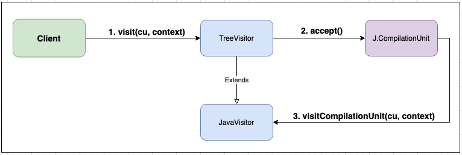

import ReactPlayer from 'react-player';

# Visitors

In OpenRewrite [recipes](./recipes.md), a visitor is where the core logic lives. It determines what elements should be updated and when.

To help you understand more about visitors, this guide will walk you through numerous concepts and examples. By the end, you should feel more confident in working with and implementing visitors in your own recipes.

<ReactPlayer url='https://www.youtube.com/watch?v=BLCW9Ql7swI' />

<ReactPlayer url='https://www.youtube.com/watch?v=4azJ9Y9De5M' />

## Background

In the [visitor pattern](https://en.wikipedia.org/wiki/Visitor_pattern#Java_example), you have an object structure to navigate (LSTs), the client application doing the navigation, and visitors that specify what operation to perform on a given instance of a class.

When recipes are executed, you can think of it as a client application navigating the LST structure. The default implementation of the `visitElement` method supplied with OpenRewrite traverses the tree depth-first. The recipe contains one or more overrides of `visitElement` and, therefore, allows you to intercept this type of LST element as the tree is being navigated.

Given that the code (and LSTs) are deeply nested structures, it is important that the whole LST tree is traversed. If not, you will likely miss the LST element you want to change. This is why you need to call `super.visitElement` from your implementation. If you don't, you will not traverse down the tree.

The reason we didn't automate LST navigation (i.e., made it into an event-driven system) and left it to recipe authors to implement, is that sometimes it is hard to know if the subtree needs to be navigated _before_ changing a particular element (in which case you'd call `super.visitElement` first and gather some data from the subtree to inform your decision about how to change the element) or if the subtree needs to be navigated _after_ changing the element, or if you want to traverse the tree more than one or even skip it altogether.

Because an LST is a deeply nested structure, a full traversal of the LST is required to collect items of the same type (like all classes). Therefore, if we want to collect all classes, we need to traverse the LST. As recipes may want to act on more than one element type, we cannot have a system that returns all classes or all methods without implementing the traversal.

## Key components

All OpenRewrite visitors share a common structure and life cycle. In order to effectively work with visitors, it's necessary to understand these topics.

Let's dive into the most important ones:

### Tree

Visitors always accept and return a parameterized type that extends `Tree`. This interface is the foundational contract for all types defined within any LST (both visitors and LSTs stem from this `Tree` interface).

The `Tree` interface has the following characteristics:

* It has a unique ID that can be used to identify it as a specific LST, even after transformations have taken place on it.
* It has an `accept()` method that acts as a callback into a language-specific visitor.
* It can convert itself back into a source-readable form via several `print()` methods.
* It contains [markers](./markers.md) which provide metadata about the LST.

### TreeVisitor

All of OpenRewrite's visitors extend the abstract class `TreeVisitor<T extends Tree, P>`. It is this class that provides the generic, parameterized `visit(T, P)` method that drives a visitor's polymorphic navigation, cursoring, and life cycle.

The parameterized type `T` represents the type of LSTs upon which the visitor will navigate and transform. The second parameter, `P`, is an additional, shared context that is passed to all visit methods as a visitor navigates a given LST (See [sharing data between visitors](#sharing-data-between-visitors) for more information).

### Cursoring

All visitors have access to a `Cursor` which keeps track of a visitor's position within the LST while it is being traversed. Since LSTs are acyclic and therefore do not contain references to their parent element, the `Cursor` is the primary mechanism by which parent or sibling LSTs may be accessed.

Logically a `Cursor` is a stack. Whenever an LST is visited, a `Cursor` pointing to it is pushed on top of the stack. When the visit for the LST completes, its `Cursor` is removed from the stack. In this way, the `Cursor` keeps track of the visitor's current position within the LST.

As an example of how the `Cursor` can be helpful, imagine a visitor that is tasked with traversing a Java LST and marking only the top-level class as "final". The [compilation unit](#compilationunit) may include a class that has several nested classes. Visiting such a tree would result in the `visitClassDeclaration()` method being called multiple times, once for each class declaration. The `Cursor` can be used to determine which [class declaration](#classdeclaration) represents the top-level class:

```java
@Override
public J.ClassDeclaration visitClassDeclaration(J.ClassDeclaration cd, ExecutionContext context) {
    // The base class provides the language-specific navigation of sub-elements
    // Without this invocation, sub-elements such as inner classes will never be visited
    J.ClassDeclaration classDeclaration = (J.ClassDeclaration) super.visitClassDeclaration(cd, context);

    // Visitors must always decline to make an unnecessary change
    if (classDeclaration.hasModifier(J.Modifier.Type.Final)) {
        return classDeclaration;
    }

    // If the current class declaration is not enclosed by another class declaration,
    // it must be the top-level class.
    if (getCursor().getParentOrThrow().firstEnclosing(J.ClassDeclaration.class) == null) {
        classDeclaration = classDeclaration.withModifiers(ListUtils.concat(classDeclaration.getModifiers(),
                new J.Modifier(Tree.randomId(), Space.EMPTY, Markers.EMPTY,
                        J.Modifier.Type.Final, Collections.emptyList())));

        // Ensure modifiers are in the idiomatic order
        classDeclaration = (J.ClassDeclaration) new ModifierOrder().getVisitor()
                .visitNonNull(classDeclaration, context);

        // Format only the method declaration, stopping after the modifiers
        // Making the most minimal possible change makes changes easier for reviewers to accept
        classDeclaration = autoFormat(classDeclaration, classDeclaration.getName(), context, getCursor().getParentOrThrow());
    }

    return classDeclaration;
}
```

Each `Cursor` within the stack has a `Map` into which arbitrary data may be read from or written to. This data is thrown away (along with the `Cursor` which contains it) once the visit is over. The purpose of this mechanism is to facilitate communication between different visit methods. Because this information is discarded when visiting is complete, there is no need to worry about it affecting any other visitor or recipe in the run.

For example, imagine you wanted to make a visitor which needs to change to a class declaration based on something it finds within a method declaration. You could freely add information to the cursor without worry that this would affect any other visitors or recipes:

```java
public class ChangesClassBasedOnMethod extends JavaIsoVisitor<ExecutionContext> {
    @Override
    public J.ClassDeclaration visitClassDeclaration(J.ClassDeclaration cd, ExecutionContext ctx) {
        // Traverses down into sub-elements of the current class declaration
        J.ClassDeclaration classDeclaration = (J.ClassDeclaration) super.visitClassDeclaration(cd, ctx);

        J.MethodInvocation methodInvocation = getCursor().pollMessage("FOUND_METHOD");
        if (methodInvocation != null) {
            // Do something with the information which has been provided via the cursor
        }

        return classDeclaration;
    }

    @Override
    public J.MethodDeclaration visitMethodDeclaration(J.MethodDeclaration methodDeclaration, ExecutionContext ctx) {
        if (/* methodDeclaration meets some criteria */) {
            // Puts the message on the cursor corresponding to the element this message will be read from
            getCursor().putMessageOnFirstEnclosing(J.ClassDeclaration.class, "FOUND_METHOD", methodDeclaration);
        }

        return methodDeclaration;
    }
}
```

## Language-specific visitors

Each language binding contains a visitor implementation that extends `TreeVisitor`. As an example, the OpenRewrite language binding for Java is [JavaVisitor](https://github.com/openrewrite/rewrite/blob/main/rewrite-java/src/main/java/org/openrewrite/java/JavaVisitor.java) and the language binding for YAML is [YamlVisitor](https://github.com/openrewrite/rewrite/blob/main/rewrite-yaml/src/main/java/org/openrewrite/yaml/YamlVisitor.java). It is in these language-specific source visitors that the visit methods for each LST are defined, along with the language-specific traversal logic.

```java
class JavaVisitor<P> extends TreeVisitor<J, P> {
  J visitStatement(Statement statement) {...}
  J visitTypeName(NameTree name) {...}
  J visitAnnotatedType(J.AnnotatedType annotatedType)  {...}
  J visitAnnotation(J.Annotation annotation) {...}
  J visitArrayAccess(J.ArrayAccess arrayAccess) {...}
  J visitArrayType(J.ArrayType arrayType) {...}
  J visitAssert(J.Assert azzert) {...}
  J visitAssignment(J.Assignment assign) {...}
  J visitAssignmentOperation(J.AssignmentOperation assignOp) {...}
  J visitBinary(J.Binary binary) {...}
  ...
}
```

An important concept to understand is what happens when the generic `TreeVisitor.visit(T, P)` method is called and how that is mapped into its language-specific counterpart. Let's visualize how a Java `CompilationUnit` is passed from a client to a visitor:



The most obvious observation is that calling the generic form of `visit()` will result in having the compilation unit's `accept()` method executed. The `accept()` method will then cast the visitor to the language-specific variant and then call the appropriate, language-specific `visitCompilationUnit()` method.

Less obvious, in the above visualization, is that the base implementation also maintains the cursor position and manages the visitor life-cycle.

:::danger
STRONG WARNING!

A client may have a reference to the language-specific visitor and it may be tempting to call the language-specific visit methods directly. However, circumventing the generic `TreeVisitor.visit()` method will result in the `cursor` not working and key life-cycle management methods not being visited.
:::

## Isomorphic vs. non-isomorphic visitors

Every language has two types of visitors: an [isomorphic](https://en.wikipedia.org/wiki/Isomorphism) (iso) visitor and a non-isomorphic visitor. Essentially, a visitor that is isomorphic will always replace LSTs with LSTs that are the exact same type.

For instance, in the [JavaIsoVisitor](https://github.com/openrewrite/rewrite/blob/main/rewrite-java/src/main/java/org/openrewrite/java/JavaIsoVisitor.java), a `visitClassDeclaration` function will _always_ return a `J.ClassDeclaration`. Likewise, a `visitBinary` will always return a `J.Binary`. You can modify those LSTs to have different values, but at the end of the day, the type needs to be the same. This greatly simplifies the development process as the compiler and type system will help enforce these restrictions.

There are some cases, however, where you might want to replace LSTs with other types of LSTs (such as replacing a method with a variable declaration). If you tried to use the `JavaIsoVisitor` for something like that, you would get an exception as the type system would not allow for that change. Instead, you should use the [JavaVisitor](https://github.com/openrewrite/rewrite/blob/main/rewrite-java/src/main/java/org/openrewrite/java/JavaVisitor.java) class instead. Just be aware that you will lose many of the automated checks during development.

:::tip
If your recipe can use the isomorphic visitor, you should favor that over the non-isomorphic visitor.
:::

:::info
Search recipes are a great example of when JavaVisitor should be used over JavaIsoVisitor. For instance, [FindRepeatableAnnotations](https://github.com/openrewrite/rewrite/blob/main/rewrite-java/src/main/java/org/openrewrite/java/search/FindRepeatableAnnotations.java) will return a SearchResult instead of an Annotation if it finds one - which wouldn't be possible if JavaIsoVisitor was used.
:::

## Sharing data between visitors

Most of the time, visitors will extend a tree that has an [ExecutionContext](#execution-context) type such as in `JavaIsoVisitor<ExecutionContext>`. This context allows recipes to share state and respond to changes in other recipes.

There are some cases, though, where you may want to share other types of information between visitors. For instance, you may want to count the number of times a method appears or define a boolean that detects if a change has happened or not.

In those cases, you can specify a different, mutable type for your visitor such as in this visitor which counts the number of method invocations in a Java LST:

```java
public class MethodCountVisitor extends JavaIsoVisitor<AtomicInteger> {
    @Override
    public J.MethodInvocation visitMethodInvocation(J.MethodInvocation method, AtomicInteger counter) {
        // Increment the shared counter when visiting a method invocation.
        counter.incrementAndGet();

        return super.visitMethodInvocation(method, counter);
    }

    public static int countMethods(Tree tree) {
        return new MethodCountVisitor().reduce(tree, new AtomicInteger()).get();
    }
}
```

:::info
You _do not_ need to worry about thread safety with the type that you use in your visitor. In the above example, we chose to use an `AtomicInteger` simply because it's a mutable integer object.
:::

You could then use this visitor in a recipe:

```java
public class TestRecipe extends Recipe {
    // ...

    @Override
    protected JavaIsoVisitor<ExecutionContext> getVisitor() {
        return new JavaIsoVisitor<ExecutionContext>() {
            @Override
            public J.ClassDeclaration visitClassDeclaration(J.ClassDeclaration classDecl, ExecutionContext executionContext) {
                MethodCountVisitor visitor = new MethodCountVisitor();

                int counterOption1 = MethodCountVisitor.countMethods(classDecl);

                AtomicInteger counterOption2 = new AtomicInteger();
                visitor.visitClassDeclaration(classDecl, counterOption2);

                // Do something with based on the counter
                System.out.println("Option 1: " + counterOption1);
                System.out.println("Option 2: " + counterOption2);

                return super.visitClassDeclaration(classDecl, executionContext);
            }
        };
    }
}
```

Or you could use this visitor in a test:

```java
@Test
void countsMethods() {
    rewriteRun(
        java(
            """
              public class Main {
                    static void myMethod() {
                        System.out.println("Hello World 1!");
                        System.out.println("Hello World 2!");
                        System.out.println("Hello World 3!");
                    }
                }
              """,
            spec -> spec.afterRecipe(compilationUnit ->
                    assertThat(MethodCountVisitor.countMethods(compilationUnit)).isEqualTo(3))
        )
    );
}
```

If you'd like to see a more complex, real-world example, check out the [FinalizeLocalVariables](https://github.com/openrewrite/rewrite/blob/main/rewrite-java/src/main/java/org/openrewrite/java/cleanup/FinalizeLocalVariables.java) recipe or read through our [multiple visitors doc](../authoring-recipes/multiple-visitors.md).

## Chaining visitors

Visitors can be chained together by calling `doAfterVisit(anotherVisitor)`. Some visitors, such as the `JavaVisitor`, include wrappers for this method to make your life easier such as with [maybeAddImport](https://github.com/openrewrite/rewrite/blob/v7.35.0/rewrite-java/src/main/java/org/openrewrite/java/JavaVisitor.java#L102-L127) and [maybeRemoveImport](https://github.com/openrewrite/rewrite/blob/v7.35.0/rewrite-java/src/main/java/org/openrewrite/java/JavaVisitor.java#L129-L140).

You can see this being used in the [ChangeFieldType recipe](https://github.com/openrewrite/rewrite/blob/v7.35.0/rewrite-java/src/main/java/org/openrewrite/java/ChangeFieldType.java). We delegate out to other visitors to determine if we should [potentially add an import](https://github.com/openrewrite/rewrite/blob/v7.35.0/rewrite-java/src/main/java/org/openrewrite/java/ChangeFieldType.java#L44) or if we should [potentially remove an import](https://github.com/openrewrite/rewrite/blob/v7.35.0/rewrite-java/src/main/java/org/openrewrite/java/ChangeFieldType.java#L45) from the code our visitor is producing.

## Further reading

If you'd like to see more examples of how visitors are created and used in recipes, please check out these guides:

* [Writing a Java refactoring recipe](../authoring-recipes/writing-a-java-refactoring-recipe.md)
* [Modifying methods with JavaTemplate](../authoring-recipes/modifying-methods-with-javatemplate.md)
* [Creating multiple visitors in one recipe](../authoring-recipes/multiple-visitors.md)
