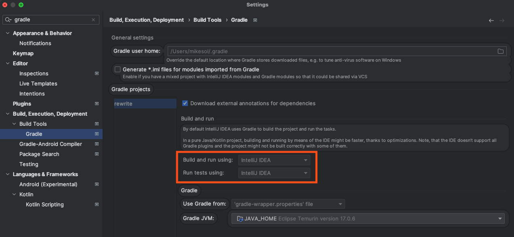

# Building and developing OpenRewrite

## Building OpenRewrite

OpenRewrite is built with [Gradle](https://gradle.org/). It is not typically necessary to manually install Gradle, as invoking the `./gradlew` (Linux and Mac) or `gradlew.bat` (Windows) shell scripts will download the appropriate version of Gradle to your user directory.

OpenRewrite requires several JDK versions to be installed on your system to accommodate the rewrite-java-8, -11, 17 and -21 modules.
If you wish to limit the JDKs required, follow the instructions in `IDE.properties.tmp` in the root of `openrewrite/rewrite`.

:::danger
If you are developing on a Mac with Apple silicon, you must install the Java 1.8 JDK manually (for example using [SDKMAN!](https://sdkman.io/)), as there is no matching JDK available on Adoptium.
:::

To compile and run tests, invoke `./gradlew build`. To publish a snapshot build to your maven local repository, run `./gradlew publishToMavenLocal`.

<details>

<summary>
If some of your tests fail with an `IllegalArgumentException` about invalid GPG credentials:
</summary>

Please try running the following command in the `rewrite` directory to disable GPG signing for your commits:

```bash
git config commit.gpgsign false
```

After this succeeds, please re-run the build. You should not longer see the error. This error is due to the fact that there are some tests that use the [JGit](https://projects.eclipse.org/projects/technology.jgit) library to run git commands, which at the time of writing does not support SSH-based signed commits. See [this bug](https://bugs.eclipse.org/bugs/show\_bug.cgi?id=581483) for more information.

</details>

## Building within Secure/Isolated environments

OpenRewrite typically accesses the Maven Central artifact repository to download necessary dependencies. If organizational security policy or network configuration forbids this, then you can use a Gradle [init script](https://docs.gradle.org/current/userguide/init\_scripts.html) to forcibly reconfigure the OpenRewrite build to use a different repository.

Copy this script to a file named `init.gradle.kts` into the `/.gradle` directory. Modify the `enterpriseRepository` value as appropriate for your situation.

<details>

<summary>`init.gradle.kts`</summary>

```kotlin title="init.gradle.kts"
import org.gradle.api.artifacts.repositories.MavenArtifactRepository
import org.gradle.api.internal.artifacts.repositories.DefaultMavenLocalArtifactRepository

// Replace with your organization's artifact repository which mirrors the contents of Maven Central
val mavenCentralMirror = "https://repo.maven.apache.org/maven2/"
// Replace with your organization's artifact repository which mirrors the contents of the Gradle Plugin portal
val gradlePluginPortalMirror = "https://plugins.gradle.org/m2"
// Replace with your organization's artifact repository which mirrors the contents of Gradle's 
// This one is required only for building the rewrite-gradle project
val gradleLibsRelease = "https://repo.gradle.org/gradle/libs-releases-local/"

val allowedRepos = listOf(mavenCentralMirror, gradlePluginPortalMirror, gradleLibsRelease)

// Fill out as appropriate if your repository requires authentication
// Consider using system properties to fill these in for better security
val user: String? = null; 
val pass: String? = null;

fun repoIsAcceptable(repo: ArtifactRepository): Boolean = 
    repo is DefaultMavenLocalArtifactRepository || 
    (repo is MavenArtifactRepository && allowedRepos.find { it == (repo as MavenArtifactRepository).getUrl().toString() } != null)

beforeSettings {
    pluginManagement.repositories {
        all { 
            if (!repoIsAcceptable(this)) {
                remove(this)
            }
        }
        mavenLocal()
        allowedRepos.forEach { enterpriseRepository ->
            maven { 
                url = uri(enterpriseRepository)
                if(user != null && pass != null)  {
                    authentication {
                        create<BasicAuthentication>("basic")
                    }
                    
                    credentials {
                        username = user
                        password = pass
                    }
                }
            }
        }
    }
}
allprojects {
    repositories {
        all { 
            if (!repoIsAcceptable(this)) {
                remove(this)
            }
        }
        mavenLocal()
        allowedRepos.forEach { enterpriseRepository ->
            maven { 
                url = uri(enterpriseRepository)
                if(user != null && pass != null)  {
                    authentication {
                        create<BasicAuthentication>("basic")
                    }
                    
                    credentials {
                        username = user
                        password = pass
                    }
                }
            }
        }
    }
}

```

</details>

With this file placed, all of your Gradle builds will prefer to use your corporate repository instead of whatever repositories they would normally be configured with.

## Developing tips

We recommend that you use [IntelliJ IDEA](https://www.jetbrains.com/idea/) for development, as some of the Gradle specifics in `openrewrite/rewrite` are not supported as well in other IDEs. We also require all code contributions to be formatted using the IntelliJ IDEA auto-formatter.

### IntelliJ IDEA changes

#### Speed up tests

By default, IntelliJ IDEA uses Gradle to build and run tests with. While that ensures compatibility, it is very slow. To help speed up compilation and testing, we recommend that you change this to use `IntelliJ IDEA` instead. You can update this by going to the IntelliJ settings, searching for Gradle, and clicking on the [Settings | Build, Execution, Deployment | Build Tools | Gradle](jetbrains://idea/settings?name=Build%2C+Execution%2C+Deployment--Build+Tools--Gradle) setting:



As part of doing that, you'll also need to update the Java Compiler under [Settings | Build, Execution, Deployment | Compiler | Java Compiler](jetbrains://idea/settings?name=Build%2C+Execution%2C+Deployment--Compiler--Java+Compiler) to set the `-parameters` compiler flag. If your system does not have `UTF-8` as its default character encoding (e.g., Windows), you must also add `-encoding utf8`.


:::danger
If you've previously run tests using Gradle and you update the project to use IntelliJ instead, it's a good idea to make sure that your tests are actually using IntelliJ rather than Gradle. You can confirm the tests are not using Gradle by clicking on the run configurations in the top right hand corner of IntelliJ and ensuring that the tests have a left and right arrow next to them instead of the Gradle icon:

**Correct**:  


**Incorrect**: 


:::

#### Additional overrides if working on compiler internals

_This will not apply to most people as a typical recipe module will not directly reference compiler internals._

If you need to reference internals of the compiler, please add an override to the compiler parameters under [Settings | Build, Execution, Deployment | Compiler | Java Compiler](jetbrains://idea/settings?name=Build%2C+Execution%2C+Deployment--Compiler--Java+Compiler) for the `rewrite.rewrite-java-17.main` module to have the compilation options of:

```bash
-parameters --add-exports jdk.compiler/com.sun.tools.javac.comp=ALL-UNNAMED --add-exports jdk.compiler/com.sun.tools.javac.file=ALL-UNNAMED --add-exports jdk.compiler/com.sun.tools.javac.main=ALL-UNNAMED --add-exports jdk.compiler/com.sun.tools.javac.tree=ALL-UNNAMED --add-exports jdk.compiler/com.sun.tools.javac.util=ALL-UNNAMED --add-exports jdk.compiler/com.sun.tools.javac.code=ALL-UNNAMED
```


### Diff view when running tests

When a test fails, it can often times be difficult to read what is wrong if you just look in the terminal. One trick with IntelliJ and testing is, after your tests are run, press `Command + D` or right-click on your test and select `View <testName> Difference`. That will open up a diff window that shows the expected and the actual result.

<figure>
  
  <figcaption>_Right-click on a test to open up this modal._</figcaption>
</figure>

<figure>
  
  <figcaption>_What the diff view looks like._</figcaption>
</figure>

### Optimizing your IDE for only modules you want to work on

If you are only working on a subset of the modules in [openrewrite/rewrite](https://github.com/openrewrite/rewrite), you can optimize your IDE to only load those modules. To do so, create a new `IDE.properties` file if one doesn't exist in the base directory of the project. Then, copy the contents of [IDE.properties.tmp](https://github.com/openrewrite/rewrite/blob/main/IDE.properties.tmp) file to it. Next, comment out any lines that correspond to modules that you do not want to work on. This will cause Gradle to swap those project dependencies for binary dependencies resolved from either Maven local or the OSS snapshots repository – which will speed up your IDE.

### Windows Caveats

If you are contributing to OpenRewrite on Windows, please ensure that you set `core.autocrlf = false` as [Rewrite](https://github.com/openrewrite/rewrite) requires unix-style line endings. This can be done when you clone the repository:

```bash
git clone -c core.autocrlf=false https://github.com/openrewrite/rewrite.git
```

Also, as mentioned in the [IntelliJ IDEA section](#intellij-idea-changes) above, please ensure that your system uses `UTF-8` for character encoding.
