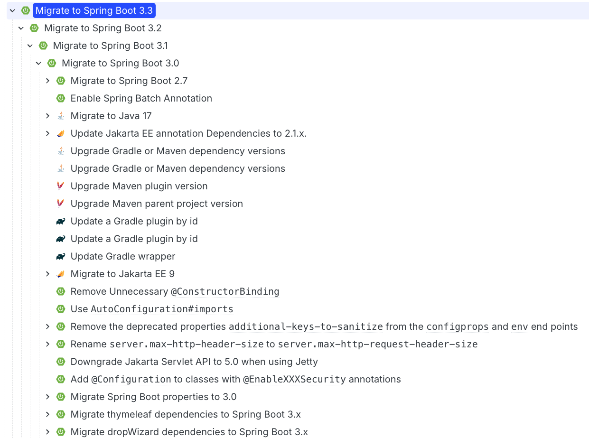

# How to customize recipes to meet your needs

OpenRewrite recipes are **opinionated** – meaning that they encourage certain conventions, patterns, or practices. The idea behind this is to provide sensible defaults that work for _most_ people _most_ of the time without requiring any fiddling. 

However, what if you run into a situation where you would like recipes to behave differently? Your first instinct might be that you need to copy the existing recipe and modify it to meet your needs.

Fortunately, in many cases, recipes can be easily modified, broken apart, or combined – without needing to write any code.

In this guide, we'll walk you through how to do this.

## Customizing a recipe

For the sake of this guide, let's assume that you took a look at the [Common static analysis issues recipe](../recipes/staticanalysis/commonstaticanalysis.md) and decided that you don't like the fact that it [disallows multiple variables from being declared on the same line](../recipes/staticanalysis/multiplevariabledeclarations.md). You want to remove that recipe from the list of recipes being executed – but you still want to run all of the other ones.

To edit this recipe, we'll take advantage of the [Moderne recipe builder](https://docs.moderne.io/user-documentation/moderne-platform/how-to-guides/new-recipe-builder/).

### Step 1: Navigate to the Moderne Recipe Builder

Open up the [Moderne Platform](https://app.moderne.io/marketplace), sign in, and navigate to the [Moderne Recipe Builder](https://app.moderne.io/builder).

### Step 2: Create a new recipe

On the right side of the page, you should see a `Recipe` dropdown button. Click it and then select `New`:

<figure>
  
</figure>

A modal will pop up where you can enter a name, Id, and a description for the recipe. Name it something intuitive such as:

<figure>
  
  <figcaption>_New recipe modal_</figcaption>
</figure>

Once you've filled out the modal, press `Save` in the bottom right corner.

### Step 3: Add the recipe to modify

So far, we've created a root node for the recipe. The next thing we want to do is add the recipe we want to modify to this node. To do so, mouse over the root node in the recipe list and press the `+` button to add a recipe:

<figure>
  
  <figcaption>_Adding a new recipe_</figcaption>
</figure>

In the modal that pops up, search for `Common static` and add the `Common static analysis issues` recipe by selecting it and then pressing `Select recipe`:

<figure>
  
  <figcaption>_Recipe search modal_</figcaption>
</figure>

You should then see that all of the recipes that make up the common static analysis recipe are added to your recipe list:

<figure>
  
  <figcaption>_Common static analysis recipes_</figcaption>
</figure>

### Step 4: Modify the recipes to meet your needs

With all of those recipes in the builder, we can now go ahead and change it to match our needs. As we said earlier, let's pretend that we want to remove the recipe that doesn't allow us to define multiple variables on one line.

To do so, let's search for a recipe with that name and then press the trash can icon to remove it from the recipe list:

<figure>
  
  <figcaption>_Removing a recipe_</figcaption>
</figure>

### Step 5: Download the modified recipe and run it

Once you have the recipe to where you want it, you can download it as a YAML file so that you can use OpenRewrite to run it. To do so, click on the `Download YAML` button in the Recipe drop-down menu:

<figure>
  
  <figcaption>_Download recipe_</figcaption>
</figure>

You can then run it as you would any other OpenRewrite recipe.

## Breaking apart recipes

In some situations, you may find that a recipe would change more than what you'd like to commit to. For instance, let's consider the [Migrate to Spring Boot 3.3 recipe](../recipes/java/spring/boot3/upgradespringboot_3_3.md). This recipe is quite complex and is composed of 2682 other recipes:

<figure>
  
  <figcaption>_Spring Boot 3.3 recipe visual_</figcaption>
</figure>

<figure>
  
  <figcaption>_Spring Boot 3.3 recipe list (not all recipes shown)_</figcaption>
</figure>

Rather than running all of these recipes at once, you may find it beneficial to look through the recipe list and run some of the smaller recipes first. By doing so, you can reduce the scope of issues that may arise, and make it easier for people to review/merge in changes.

Imagine you have a Java 11 project using JUnit 4 and Spring Boot 2.3. If you ran the Spring Boot 3.3 recipe, your project would be [migrated to Java 17](../recipes/java/migrate/upgradebuildtojava17.md) and [JUnit 4 would be upgraded to JUnit 5](../recipes/java/spring/boot2/springboot2junit4to5migration.md) (among other things). Those are both substantial upgrades on their own - so you may want to consider running _just_ one of those recipes to begin.

For some of the more popular recipes (such as the two mentioned above), we have [guides that give additional context and walk you through all that you need to do](./popular-recipe-guides/migrate-to-java-17.md).

If you decide that you want to customize one of those recipes further (perhaps by adding or removing recipes from it), make sure you [check out the section above on how to do that](#customizing-a-recipe).

## Combining recipes together

The recipe builder can also be useful if you want to combine multiple recipes together. For instance, let's say that you wanted to make your own best practices recipe. You could add many recipes to the list and then [save it as a new, larger recipe](#step-5-download-the-modified-recipe-and-run-it):

<figure>
  
  <figcaption>_Combining many recipes_</figcaption>
</figure>