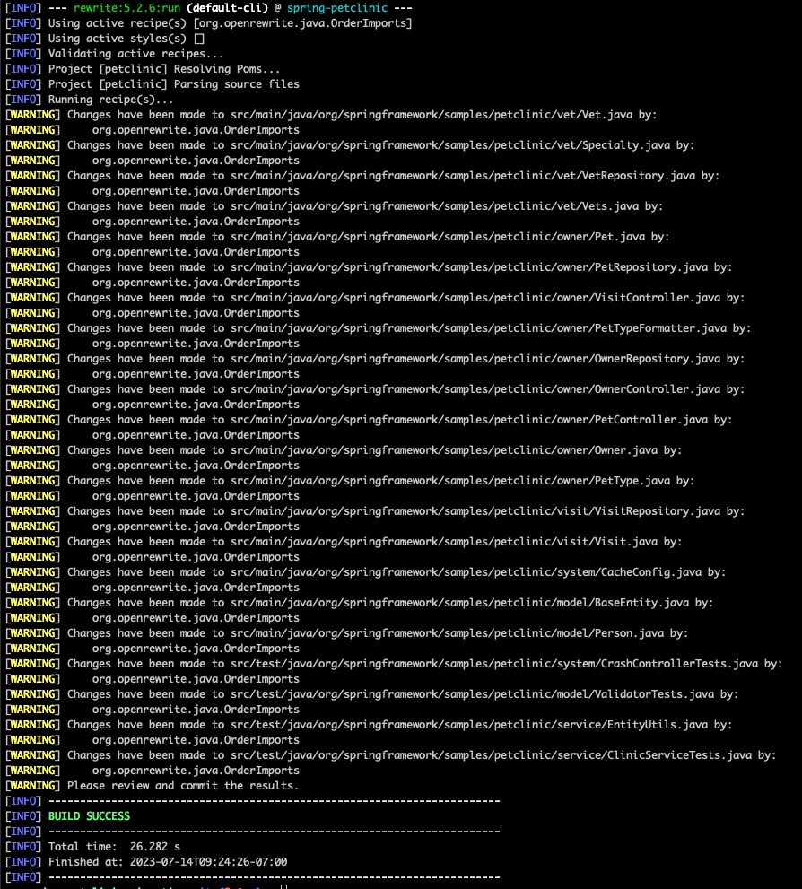
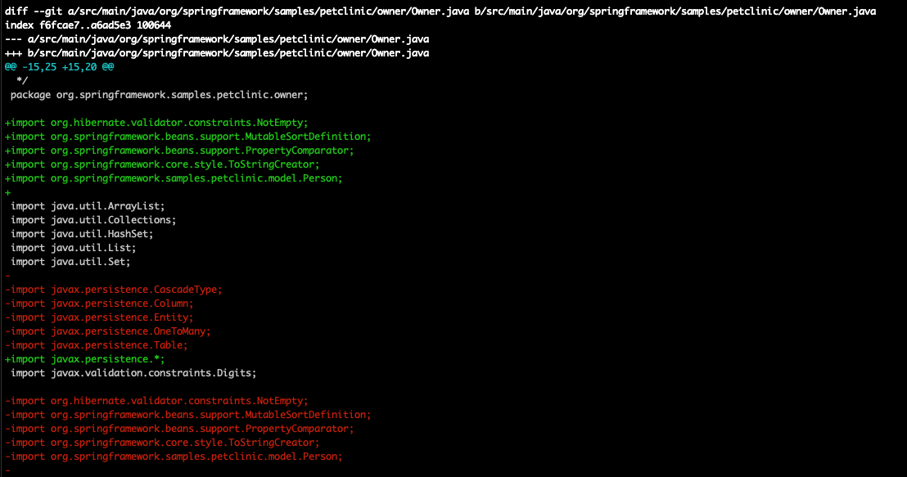
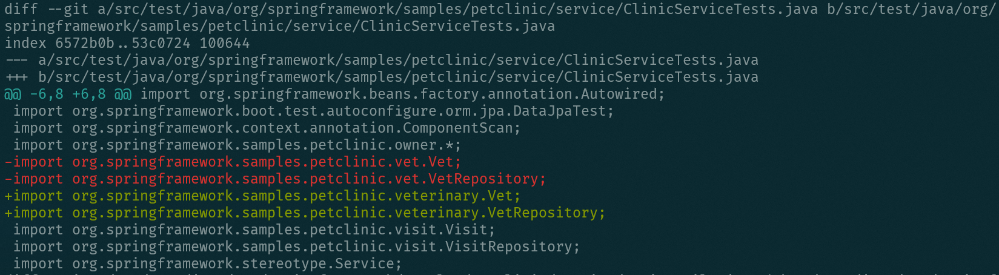

import Tabs from '@theme/Tabs';
import TabItem from '@theme/TabItem';

# Quickstart: Setting up your project and running recipes

To help orient you to OpenRewrite, let's walk through configuring a project to use the Maven or Gradle OpenRewrite plugin. Then let's walk through running various types of recipes on said project and talk through the results.

In this guide, you will:

* [Clone a sample project](#step-1-clone-sample-project)
* [Add the rewrite-maven-plugin or rewrite-gradle-plugin to your project](#step-2-add-rewrite-maven-plugin-or-rewrite-gradle-plugin-to-your-project)
* [Activate a recipe so it can be run](#step-3-activate-a-recipe)
* [Run a simple refactoring recipe](#step-4-run-a-simple-refactoring-recipe)
* [Run a recipe with YAML configuration](#step-5-run-a-recipe-with-yaml-configuration)
* [Add and run an externally created recipe](#step-6-running-recipes-from-external-modules)

:::info
If you are a Moderne customer, you should use the [Moderne CLI](https://docs.moderne.io/user-documentation/moderne-cli/getting-started/cli-intro) or the [Moderne Platform](https://docs.moderne.io/user-documentation/moderne-platform/getting-started/running-your-first-recipe) to run recipes rather than following the instructions in this doc.
:::

## Prerequisites

This quickstart guide assumes that you:

* Are somewhat familiar with Java
* Have worked with a Maven or a Gradle project before
* Know how to run commands in the command line
* Can run basic Git commands

## Step 1: Clone sample project

The first step in this process is making sure you have some code to work with. We've prepared a [sample repository](https://github.com/openrewrite/spring-petclinic-migration) that you can use if you'd like. However, as all of the steps in this guide apply to any Java project built with Maven or Gradle, please feel free to use your own and skip to [Step 2](#step-2-add-rewrite-maven-plugin-or-rewrite-gradle-plugin-to-your-project).

:::warning
The sample **spring-petclinic project** requires JDK version 11+ to build (OpenRewrite does not have this requirement -- just this sample project). Get OpenJDK 11 [here](https://adoptium.net/temurin/releases/?version=11) if you do not already have that version installed.

If you are building the project in IntelliJ and are using Gradle, make sure that you set your Gradle JVM to 11 (Build, Execution, Deployment → Build Tools → Gradle → Gradle JVM).
:::

To clone the [openrewrite/spring-petclinic-migration](https://github.com/openrewrite/spring-petclinic-migration) repository, please run this command:

```bash
git clone https://github.com/openrewrite/spring-petclinic-migration.git
```

## Step 2: Add rewrite-maven-plugin or rewrite-gradle-plugin to your project

Once you've checked out your project, the next step is to add the OpenRewrite plugin to Maven or Gradle.

OpenRewrite releases, including the Maven and Gradle plugins themselves, are published to the Code Genome Project repository (`https://artifacts.codegenomeproject.org/maven`), which requires authentication. To get access, sign in to the Code Genome Project and create a download token. Your build then authenticates with the email or username you signed in with, plus that token as the password.

Gradle builds read those credentials from `gradle.properties`. Put them in `~/.gradle/gradle.properties` rather than the copy in your repository, so they are never committed:

```properties title="~/.gradle/gradle.properties"
codeGenomeUsername=you@example.com
codeGenomeToken=your-download-token
```

In CI, set the `ORG_GRADLE_PROJECT_codeGenomeUsername` and `ORG_GRADLE_PROJECT_codeGenomeToken` environment variables instead. Maven builds keep the same credentials in `settings.xml`, where the snippets below use `USERNAME` and `TOKEN` as placeholders.

What you can download depends on your account: OpenRewrite's Apache-licensed recipes and the Moderne CLI are available to any authenticated user, while [source-available](/licensing/openrewrite-licensing#moderne-source-available-license) and proprietary recipes require a Moderne subscription.

Keep `mavenCentral()` in your build alongside the Code Genome Project. Earlier OpenRewrite releases remain on Maven Central, and more importantly the Code Genome Project hosts only OpenRewrite and Moderne artifacts, so your project's own dependencies, and the third-party libraries OpenRewrite itself depends on, still resolve from Maven Central.

Please follow the instructions in the Maven or Gradle tab to configure your project:

<Tabs groupId="projectType">
<TabItem value="gradle-groovy" label="Gradle (Groovy)">
    * Add the Code Genome Project repository to `pluginManagement` in your `settings.gradle` file, so that the plugin itself can be resolved
    * Add the OpenRewrite plugin to the `plugins` section of your `build.gradle` file
    * Add the Code Genome Project repository to the `repositories` section too (keep `mavenCentral()` there for your project's other dependencies)
    * Add a `rewrite` section that will be filled in later

    Your files should look similar to:

    ```groovy title="settings.gradle"
    pluginManagement {
      repositories {
        maven {
          url = 'https://artifacts.codegenomeproject.org/maven'
          credentials {
            username = providers.gradleProperty('codeGenomeUsername').get()
            password = providers.gradleProperty('codeGenomeToken').get()
          }
        }
        // Keep the portal for any other plugins your build applies
        gradlePluginPortal()
      }
    }
    ```

    ```groovy title="build.gradle"
    plugins {
      id 'java'
      id 'maven-publish'
      id 'org.openrewrite.rewrite' version '{{VERSION_REWRITE_GRADLE_PLUGIN}}'
    }

    repositories {
      // The root project doesn't have to be a Java project, but this is necessary
      // to resolve recipe artifacts.
      mavenCentral()
      maven {
        url = 'https://artifacts.codegenomeproject.org/maven'
        credentials {
          username = providers.gradleProperty('codeGenomeUsername').get()
          password = providers.gradleProperty('codeGenomeToken').get()
        }
      }
    }

    rewrite {
      // Will configure in subsequent steps
    }

    // ...
    ```
  </TabItem>
  <TabItem value="gradle-kotlin" label="Gradle (Kotlin)">
    * Add the Code Genome Project repository to `pluginManagement` in your `settings.gradle.kts` file, so that the plugin itself can be resolved
    * Add the OpenRewrite plugin to the `plugins` section of your `build.gradle.kts` file
    * Add the Code Genome Project repository to the `repositories` section too (keep `mavenCentral()` there for your project's other dependencies)
    * Add a `rewrite` section that will be filled in later

    Your files should look similar to:

    ```kotlin title="settings.gradle.kts"
    pluginManagement {
      repositories {
        maven {
          url = uri("https://artifacts.codegenomeproject.org/maven")
          credentials {
            username = providers.gradleProperty("codeGenomeUsername").get()
            password = providers.gradleProperty("codeGenomeToken").get()
          }
        }
        // Keep the portal for any other plugins your build applies
        gradlePluginPortal()
      }
    }
    ```

    ```kotlin title="build.gradle.kts"
    plugins {
      `java-library`
      `maven-publish`
      id("org.openrewrite.rewrite") version "{{VERSION_REWRITE_GRADLE_PLUGIN}}"
    }

    repositories {
      // The root project doesn't have to be a Java project, but this is necessary
      // to resolve recipe artifacts.
      mavenCentral()
      maven {
        url = uri("https://artifacts.codegenomeproject.org/maven")
        credentials {
          username = providers.gradleProperty("codeGenomeUsername").get()
          password = providers.gradleProperty("codeGenomeToken").get()
        }
      }
    }

    rewrite {
      // Will configure in subsequent steps
    }
    ```
  </TabItem>
  <TabItem value="maven" label="Maven">
    Add a new `<plugin>` in the `<plugins>` section of your `pom.xml` that looks like:

    ```markup title="pom.xml"
    <plugin>
      <groupId>org.openrewrite.maven</groupId>
      <artifactId>rewrite-maven-plugin</artifactId>
      <version>{{VERSION_REWRITE_MAVEN_PLUGIN}}</version>
    </plugin>
    ```

    The plugin and recipe modules are resolved from the Code Genome Project, so you'll also need to add the repository to your `pom.xml`:

    ```markup title="pom.xml"
    <repositories>
      <repository>
        <id>codegenome</id>
        <url>https://artifacts.codegenomeproject.org/maven</url>
      </repository>
    </repositories>
    <pluginRepositories>
      <pluginRepository>
        <id>codegenome</id>
        <url>https://artifacts.codegenomeproject.org/maven</url>
      </pluginRepository>
    </pluginRepositories>
    ```

    Lastly, add your credentials to your Maven `settings.xml` file (typically at `~/.m2/settings.xml`). The username is the email or username you signed in with, and the password is your Code Genome Project token:

    ```markup title="settings.xml"
    <settings>
      <servers>
        <server>
          <id>codegenome</id>
          <username>USERNAME</username>
          <password>TOKEN</password>
        </server>
      </servers>
    </settings>
    ```
  </TabItem>
  
</Tabs>

At this point, you're able to run any of the Maven goals or Gradle tasks provided by the OpenRewrite plugin. See [Maven Plugin Configuration](../reference/rewrite-maven-plugin.md) or [Gradle Plugin Configuration](../reference/gradle-plugin-configuration.md) for the full set of options.

From the command line, try running `mvn rewrite:discover` or `gradle rewriteDiscover` to see a list of all the recipes available for execution. Initially, this will list only the recipes built-in to OpenRewrite.

## Step 3: Activate a recipe

Before you can run any of the recipes, you will need to update the plugin configuration to mark the desired recipe(s) as "active". Let's use the [org.openrewrite.java.OrderImports](../recipes/java/orderimports.md) recipe as an example (which will ensure your imports follow a standard order). To activate this recipe, please modify your `pom.xml` or `build.gradle(.kts)` file so that the sections you modified earlier look like the below example:

<Tabs groupId="projectType">
<TabItem value="gradle-groovy" label="Gradle (Groovy)">

  ```groovy title="build.gradle"
  plugins {
    id 'java'
    id 'maven-publish'
    id 'org.openrewrite.rewrite' version '{{VERSION_REWRITE_GRADLE_PLUGIN}}'
  }

  rewrite {
    activeRecipe(
        'org.openrewrite.java.OrderImports',
    )
  }
  ```

</TabItem>
<TabItem value="gradle-kotlin" label="Gradle (Kotlin)">

  ```kotlin title="build.gradle.kts"
  plugins {
    `java-library`
    `maven-publish`
    id("org.openrewrite.rewrite") version "{{VERSION_REWRITE_GRADLE_PLUGIN}}"
  }

  rewrite {
    activeRecipe(
        "org.openrewrite.java.OrderImports",
    )
  }
  ```

</TabItem>
<TabItem value="maven" label="Maven">

  ```xml title="pom.xml"
  <plugin>
    <groupId>org.openrewrite.maven</groupId>
    <artifactId>rewrite-maven-plugin</artifactId>
    <version>{{VERSION_REWRITE_MAVEN_PLUGIN}}</version>
    <configuration>
      <activeRecipes>
        <recipe>org.openrewrite.java.OrderImports</recipe>
      </activeRecipes>
    </configuration>
  </plugin>
  ```

</TabItem>
</Tabs>

## Step 4: Run a simple refactoring recipe

Now that you've activated the `OrderImports` recipe, you can run it by executing the command:

<Tabs groupId="projectType">
<TabItem value="gradle" label="Gradle">

  ```bash
  gradle rewriteRun
  ```
</TabItem>
<TabItem value="maven" label="Maven">

  ```bash
  mvn rewrite:run
  ```
</TabItem>
</Tabs>

After running it, you will be notified of all of the files that have been changed:

<figure>
  
  <figcaption>_Console output from running `mvn rewrite:run` with OrderImports set as an active recipe in the spring-petclinic-migration repository_</figcaption>
</figure>

To see what has changed in the code, run `git diff` or use your preferred IDE's diff viewer:

<figure>
  
  <figcaption>_Sample of formatting changes made to spring-petclinic-migration by OrderImports_</figcaption>
</figure>

From there, you can commit the changes or add additional recipes based on your needs.

## Step 5: Run a recipe with YAML configuration

Some recipes are more complex than `OrderImports` and require configuration (in a `rewrite.yml` file) to run them. For instance, the built-in recipe [org.openrewrite.java.ChangePackage](../recipes/java/changepackage.md) has three options that need to be configured:

| Type      | Name           | Description                                                        |
| --------- | -------------- | ------------------------------------------------------------------ |
| `String`  | oldPackageName | The package name to replace.                                       |
| `String`  | newPackageName | New package name to replace the old package name with.             |
| `Boolean` | recursive      | _Optional_. Whether or not to recursively change subpackage names. |

To use this recipe to rename the package `org.springframework.samples.petclinic.vet` to `org.springframework.samples.petclinic.veterinary`, create a `rewrite.yml` file at the root of your project that looks like:

```yaml title="rewrite.yml"
---
type: specs.openrewrite.org/v1beta/recipe
name: com.yourorg.VetToVeterinary
recipeList:
  - org.openrewrite.java.ChangePackage:
      oldPackageName: org.springframework.samples.petclinic.vet
      newPackageName: org.springframework.samples.petclinic.veterinary
```

:::warning
YAML files are very sensitive to indentation. If you are not seeing the expected results from a YAML-configured recipe, please double-check that its arguments are indented like the above example.
:::

If the file was created correctly, you should see `com.yourorg.VetToVeterinary` listed under available recipes if you run the discover command again. Also, as mentioned earlier, in order to use this recipe, you'll need to add it to your list of active recipes:

<Tabs groupId="projectType">
<TabItem value="gradle-groovy" label="Gradle (Groovy)">

  ```groovy title="build.gradle"
  plugins {
    id 'java'
    id 'maven-publish'
    id 'org.openrewrite.rewrite' version '{{VERSION_REWRITE_GRADLE_PLUGIN}}'
  }

  rewrite {
    activeRecipe(
        'org.openrewrite.java.OrderImports',
        'com.yourorg.VetToVeterinary'
    )
  }
  ```
</TabItem>
<TabItem value="gradle-kotlin" label="Gradle (Kotlin)">

  ```kotlin title="build.gradle.kts"
  plugins {
    `java-library`
    `maven-publish`
    id("org.openrewrite.rewrite") version "{{VERSION_REWRITE_GRADLE_PLUGIN}}"
  }

  rewrite {
    activeRecipe(
        "org.openrewrite.java.OrderImports",
        "com.yourorg.VetToVeterinary"
    )
  }
  ```

</TabItem>
<TabItem value="maven" label="Maven">

  ```xml title="pom.xml"
  <build>
    <plugins>
      <plugin>
        <groupId>org.openrewrite.maven</groupId>
        <artifactId>rewrite-maven-plugin</artifactId>
        <version>{{VERSION_REWRITE_MAVEN_PLUGIN}}</version>
        <configuration>
          <activeRecipes>
            <recipe>org.openrewrite.java.OrderImports</recipe>
            <recipe>com.yourorg.VetToVeterinary</recipe>
          </activeRecipes>
        </configuration>
      </plugin>
    </plugins>
  </build>
  ```

</TabItem>

</Tabs>

Once this recipe has been added to your active recipes, you can run either `mvn rewrite:run` or `gradle rewriteRun` to execute all of your active recipes. Afterward, you'll see that:

* The source files in the `vet` package have been moved to the newly created `veterinary` package
* References such as import statements have been updated to reflect the new name
* All of the files have been formatted according to the previously defined `OrderImports` rules

<figure>
  
  <figcaption>_Git diff showing updated import statements_</figcaption>
</figure>

From there, you can confirm that everything still builds and passes its tests by running `mvn clean install` or `gradle build`.

## Step 6: Running Recipes from External Modules

At this point, you know how to configure and run any recipe included in OpenRewrite itself. However, many recipes are not bundled into the core library. For example, all of the Spring, Mockito, JUnit, and AssertJ-related recipes maintained by the OpenRewrite team live in the [rewrite-spring repository](https://github.com/openrewrite/rewrite-spring).

:::info
You can search through all of the recipes in the [OpenRewrite docs](/recipes). Each recipe page has instructions for how to import the recipe and what parameters (if any) need to be included.
:::

Let's pretend that you want to migrate JUnit 4 to JUnit 5 in a Spring project you have. If you take a look at the [Usage section](../recipes/java/spring/boot2/springboot2junit4to5migration.md#usage) in the [JUnit 4 to 5 migration recipe](../recipes/java/spring/boot2/springboot2junit4to5migration.md), you'll see what you need to include in your `build.gradle(.kts)` or `pom.xml` file in order to use this recipe.

Below, we'll walk through the [Maven](#maven--external-modules) and [Gradle](#gradle--external-modules) changes and provide some additional context around said changes.

### Maven + external modules

For Maven projects, you'll need to:

* Add the recipe to the `activeRecipes` list
* Add a dependency on the library where the desired recipe lives (JUnit 4 to 5 lives in the [rewrite-spring](https://github.com/openrewrite/rewrite-spring) repository)
* Specify a version of `rewrite-spring` to use

After doing that, your `pom.xml` file should look similar to this:

```xml title="pom.xml"
<build>
  <plugins>
      <plugin>
        <groupId>org.openrewrite.maven</groupId>
        <artifactId>rewrite-maven-plugin</artifactId>
        <version>{{VERSION_REWRITE_MAVEN_PLUGIN}}</version>
        <configuration>
          <activeRecipes>
            <recipe>org.openrewrite.java.OrderImports</recipe>
            <recipe>com.yourorg.VetToVeterinary</recipe>
            <recipe>org.openrewrite.java.spring.boot2.SpringBoot2JUnit4to5Migration</recipe>
          </activeRecipes>
        </configuration>
        <dependencies>
          <dependency>
            <groupId>org.openrewrite.recipe</groupId>
            <artifactId>rewrite-spring</artifactId>
            <version>{{VERSION_ORG_OPENREWRITE_RECIPE_REWRITE_SPRING}}</version>
          </dependency>
        </dependencies>
      </plugin>
  </plugins>
</build>
```

To double-check that everything is working, run the command `mvn rewrite:run`. Your project should be upgraded to Spring Boot 2 and all of the test classes should be updated to JUnit 5. Your `pom.xml` file will also have had its Spring dependencies updated, the JUnit 4 dependency removed, and the JUnit 5 dependency added.

:::info
Maven does not currently support using a bill of materials (BOM) to specify plugin versions or dependencies. This means that you will have to specify the versions of each plugin by hand, unlike in the Gradle section below.
:::

### Gradle + external modules

Unlike Maven projects, Gradle projects have two options for specifying recipe versions. You can:

1. Add `rewrite-recipe-bom` as a [bill of materials (BOM) dependency](https://docs.gradle.org/current/userguide/platforms.html#sub:bom\_import)
2. Add the specific dependency and version that you want (in this case `rewrite-spring`)

If you choose to use the `rewrite-recipe-bom`, you won't have to worry about specifying versions for your OpenRewrite recipes as all of the recipes you include in your `dependencies` section will have an appropriate version specified in the bill of materials (BOM). **For Gradle projects, this is the recommended approach.**

If you choose to not use `rewrite-recipe-bom`, you'll need to specify the version of each OpenRewrite recipe module you use.

Presuming you chose to use the `rewrite-recipe-bom`, your Gradle setup should look similar to this:

<Tabs groupId="projectType">
  <TabItem value="gradle-groovy" label="Groovy">
    ```groovy title="build.gradle"
    plugins {
      id 'java'
      id 'maven-publish'
      id 'org.openrewrite.rewrite' version '{{VERSION_REWRITE_GRADLE_PLUGIN}}'
    }

    rewrite {
      activeRecipe(
          'org.openrewrite.java.OrderImports',
          'com.yourorg.VetToVeterinary',
          'org.openrewrite.java.spring.boot2.SpringBoot2JUnit4to5Migration'
      )
    }

    dependencies {
      rewrite platform('org.openrewrite.recipe:rewrite-recipe-bom:latest.release')
      rewrite('org.openrewrite.recipe:rewrite-spring')

      // Other project dependencies
    }
    ```
  </TabItem>
  <TabItem value="gradle-kotlin" label="Kotlin">
    ```kotlin title="build.gradle.kts"
    plugins {
      `java-library`
      `maven-publish`
      id("org.openrewrite.rewrite") version "{{VERSION_REWRITE_GRADLE_PLUGIN}}"
    }

    rewrite {
      activeRecipe(
          "org.openrewrite.java.OrderImports",
          "com.yourorg.VetToVeterinary",
          "org.openrewrite.java.spring.boot2.SpringBoot2JUnit4to5Migration"
      )
    }

    dependencies {
      rewrite(platform("org.openrewrite.recipe:rewrite-recipe-bom:latest.release"))
      rewrite("org.openrewrite.recipe:rewrite-spring")

      // Other project dependencies
    }
    ```
  </TabItem>
</Tabs>

To check that everything worked correctly, run the command `gradle rewriteRun`. You should see that the project has been upgraded to Spring Boot 2 and all of the test classes have been updated to JUnit 5.

OpenRewrite edits Gradle build files as well as source code, so your `build.gradle(.kts)` should have had its Spring and JUnit dependencies updated too. Recipes such as [AddDependency](../recipes/gradle/adddependency.md), [ChangeDependency](../recipes/gradle/changedependency.md), and [UpgradeDependencyVersion](../recipes/gradle/upgradedependencyversion.md) handle this, and migration recipes compose them.

## Next steps

Now that you know how to configure and run recipes, you may be interested in these topics:

:::info
Before making any recipes or configuring any plugins, please [ensure your recipe development environment is set up](../authoring-recipes/recipe-development-environment.md). There are steps in there that are important to configure that go beyond what was included in this quick start guide.
:::

* [Writing a Java refactoring recipe](../authoring-recipes/writing-a-java-refactoring-recipe.md)
* [Maven plugin configuration](../reference/rewrite-maven-plugin.md)
* [Gradle plugin configuration](../reference/gradle-plugin-configuration.md)
* [Declarative YAML format](../reference/yaml-format-reference.md)
