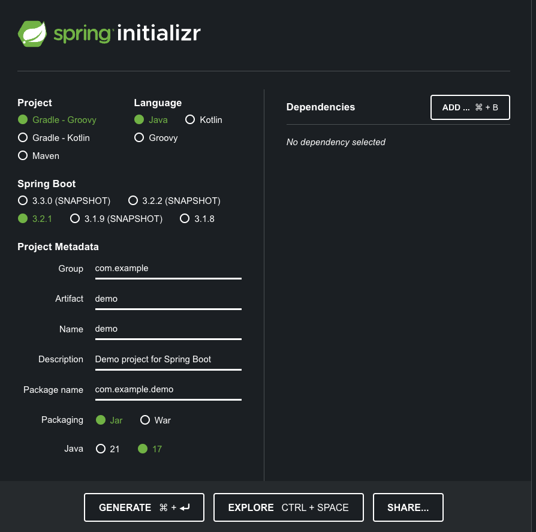

# Running Rewrite on a Gradle project without modifying the build

In this tutorial, we will apply a Rewrite recipe to a repository built with Gradle without modifying the build itself. We will use a [Gradle init script](https://docs.gradle.org/current/userguide/init_scripts.html) to accomplish this.

### Step 1: Clone a repository

To have a reproducible example, we'll start with a repository generated from [Spring Initializr](https://start.spring.io). Make sure you've selected one of the Gradle project options and Java as the language. Then press `Generate` to download a zip file:

<figure>
  
  <figcaption></figcaption>
</figure>

Extract the zip file and open the project in your favorite editor.

### Step 2: Create a Gradle init script

:::warning
If you want to use an init script you **cannot** have a `rewrite` section in your `build.gradle` file. You must pick one or the other. 
:::

Create a `init.gradle` file. It does not need to be in the project directory itself (although it will make it easier for this guide). Copy the below init script to your file:

```groovy title="init.gradle"
initscript {
    repositories {
        maven { url "https://plugins.gradle.org/m2" }
    }
    dependencies {
        classpath("org.openrewrite:plugin:latest.release")
    }
}

rootProject {
    plugins.apply(org.openrewrite.gradle.RewritePlugin)
    dependencies {
        rewrite("org.openrewrite.recipe:rewrite-spring:latest.release")
    }

    afterEvaluate {
        if (repositories.isEmpty()) {
            repositories {
                mavenCentral()
            }
        }
    }
}
```


In the `rootProject` block, we specify a dependency that contains OpenRewrite Spring recipes (`rewrite-spring`). If you wanted, you could also define a `rewrite` section inside of the `rootProject` that has elements like `activeRecipe` or `activeStyle`. In general, though, it's better to [use the command line to specify the recipes or styles](#step-4-run-the-recipe) so that you can keep your init script fairly generic. 

For a full range of options available, please see our [Gradle plugin configuration doc](../reference/gradle-plugin-configuration.md)

### Step 3: (Optional) Create a custom declarative recipe

If you wanted to create your own [declarative recipe](/authoring-recipes/types-of-recipes.md#declarative-recipes) to run as part of running the init script, you'll need to create a `rewrite.yml` file in the root of the project directory.

Here is what that might look like:

```yaml
type: specs.openrewrite.org/v1beta/recipe
name: org.openrewrite.FindSpringUses
displayName: Find all Spring uses
description: This is an example of a custom recipe.
recipeList:
  - org.openrewrite.java.search.FindMethods:
      methodPattern: org.springframework..* *(..)
```

### Step 4: Run the recipe

At this point, you are able to run the Rewrite Gradle plugin as normal (with an additional `--init-gradle` argument). Note that we did not modify the project's build script. This same init script can then be used to apply recipes to a set of projects cloned locally without changing their contents.

Here is what the Gradle command would look like if you wanted to run the above declarative recipe with the init script you created earlier (assuming you're in the same location as the `init.gradle` file):


```bash
gradle rewriteRun --init-script init.gradle -Drewrite.activeRecipe=org.openrewrite.FindSpringUses
```


For a full list of options that you can use in the Gradle command line, please see our [Gradle plugin configuration doc](../reference/gradle-plugin-configuration.md#jvm-args-that-can-be-added-to-the-gradle-command-line)