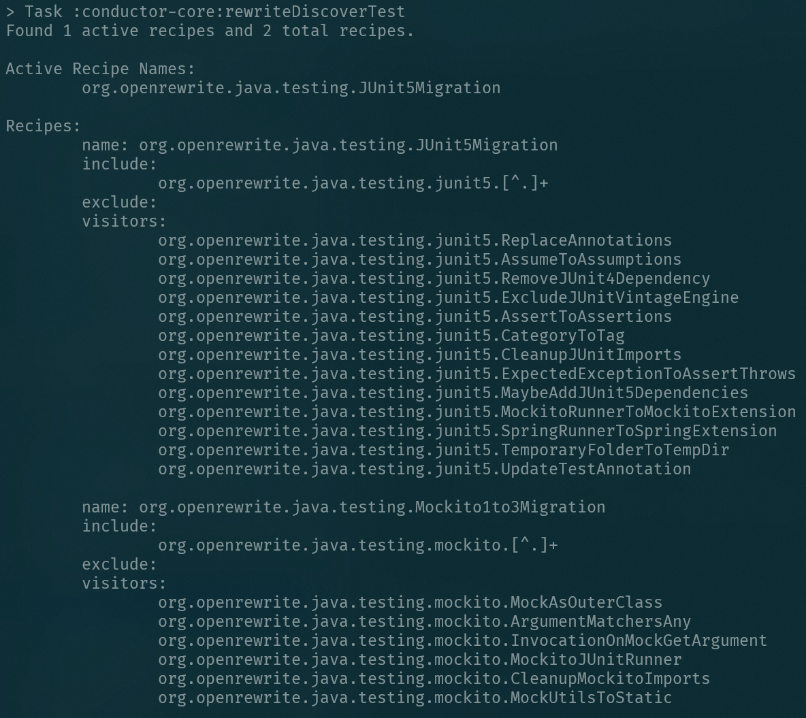

# Gradle Plugin Configuration


The Rewrite Gradle Plugin is the fastest way to apply Rewrite recipes to your code as part of your Gradle build. The Rewrite Gradle Plugin is compatible with all versions of Gradle since 4.7.

## Plugin Configuration

The recommended way of applying the plugin differs slightly between single and multi-module Gradle builds.

### Single-Module Gradle projects

Apply the org.openrewrite.rewrite plugin to your build:

```groovy
plugins {
    id("java")
    id("org.openrewrite.rewrite").version("3.0.0-rc.1")
}
rewrite {
    // Rewrite Extension Configuration
}
```

With the plugin applied, the `rewrite` DSL is available for configuration.

### Multi-Module Gradle Projects

There are innumerable different ways a multi-project Gradle build could potentially be configured. These instructions assume that the multi-project build in question is composed entirely of Java projects. If that isn't the case for your build, and you cannot easily copy and paste these snippets, the key point is to apply and configure the Rewrite plugin after wherever you apply the Java plugin.

1. In the root project's build.gradle, in the `plugins` block, add the rewrite plugin to your build's classpath with `apply` set to \`false.

   This tells Gradle to download the plugin but not to activate it for the current project.

2. In the `subprojects` block, or wherever your Java plugin is applied, also apply the rewrite plugin.

With these steps taken, your root build.gradle may look similar to this:

```groovy
 plugins {
     id("org.openrewrite.rewrite").version("3.0.0-rc.1").apply(false)
 }

 subprojects {
     apply plugin: "java"
     apply plugin: "org.openrewrite.rewrite"

     rewrite {
         // Rewrite Extension Configuration
     }
 }
```

With the plugin applied, the `rewrite` DSL is available for configuration.

### Configuring the 'rewrite' DSL

The `rewrite` DSL exposes a few configuration options:

* `activeRecipe` - Explicitly turns on recipes by name \(the name given in the `specs.openrewrite.org/v1beta/recipe` resource\). No recipe is run unless explicitly turned on with this setting.
* `activeStyle` - Explicitly turns on a style by name \(the name given in the `specs.openrewrite.org/v1beta/style` resource\). No style is applied unless explicitly turned on with this setting.
* `configFile` - Where to look for a Rewrite YML configuration file somewhere in the project directory \(or really anywhere on disk\). This file is not required to exist. If not specified otherwise, the default value is `<root project directory>/rewrite.yml`.

```groovy
plugins {
    id("java")
    id("org.openrewrite.rewrite").version("3.0.0-rc.1")
}
rewrite {
    activeRecipe("org.openrewrite.ExampleRecipe")
    activeStyle("org.openrewrite.ExampleStyle")

    // This is the default value of configFile. It is not necessary to specify this value
    configFile = project.getRootProject().file("rewrite.yml")
}
```

## Activating Rewrite Recipes


All OpenRewrite libraries and modules are published to MavenCentral. Use the `repositories` Gradle DSL to ensure that your build can resolve dependencies from there or one of its mirrors.


The plugin automatically scans the compilation time classpath of each [SourceSet](https://docs.gradle.org/current/dsl/org.gradle.api.tasks.SourceSet.html) for visitors, recipes, and styles. No recipe is ever run on your code base without being explicitly activated in the plugin's configuration.


Because the plugin uses classpath scanning, dependencies of the project can include Rewrite recipes in their releases to help migrate users of their library from one version to another.


To make pre-packaged Rewrite recipes available to apply to your product code in the "main" SourceSet, add them as `compileOnly` dependencies:

```groovy
dependencies {
    compileOnly("org.openrewrite.recipe:rewrite-spring:3.0.1")
}
```

To make pre-packaged Rewrite recipes available to apply to your test code, add them as `testCompileOnly` dependencies:

```groovy
dependencies {
    testCompileOnly("org.openrewrite.recipe:rewrite-testing-frameworks:0.8.1")
}
```

To make pre-packaged Rewrite recipes available to any other `SourceSet`, add them as `<sourceSetName>CompileOnly` dependencies.

Once a pre-packaged recipe is the appropriate classpath, you can tell the Gradle plugin to activate it the `rewrite` DSL. For example, here is how you would activate the `org.openrewrite.java.testing.JUnit5Migration` Recipe that comes with `rewrite-testing-frameworks` in a single-project Gradle build:

```groovy
plugins {
    id("java")
    id("org.openrewrite.rewrite").version("3.0.0-rc.1")
}

repositories {
    jcenter()
}

dependencies {
    testImplementation("junit:junit:4.13")
    testCompileOnly("org.openrewrite.recipe:rewrite-testing-frameworks:3.0.1")
}

rewrite {
    activeRecipe("org.openrewrite.java.testing.JUnit5Migration")
}
```

## The "Fix" Task

Execute`gradle rewriteFix` to run the active recipes and apply the changes. This will write changes locally to your source files on disk. Afterwards, review the changes, and when you are comfortalbe with the changes, commit them. The fix goal generates warnings in the build log wherever it makes changes to source files.


After the goal finishes executing, run `git diff` \(or your VCS system's equivalent\) to see what changes were made, review, and commit them.


## The "Warn" Task

Execute`gradle rewriteWarn` to dry-run the active recipes and print which visitors would make changes to which files to the build log. This does not alter your source files on disk at all. This goal can be used to preview the changes that would be made by a recipe.


It could also be manually called in a continuous integration environment, and if you so choose, fail the continuous integration build if the build log contains any such warnings.

## The "Discover" Task

Execute `gradle rewriteDiscover` to list the recipes available on your classpath. It lists the available recipes, the inclusion and exclusion configurations for those recipes, and the visitors that are effective for that each recipe based on what was found on the classpath. So in the below example, the `org.openrewrite.mockito` recipe has been defined to include all visitors prefixed in the `org.openrewrite.mockito` package. Then it lists all the visitors that have been found in that package and will be ran if that recipe is activated.



## Links

* [Github project](https://github.com/openrewrite/rewrite-gradle-plugin)
* [Issue Tracker](https://github.com/openrewrite/rewrite-gradle-plugin/issues)
* [Gradle Plugin Portal Listing](https://plugins.gradle.org/plugin/org.openrewrite.rewrite)

