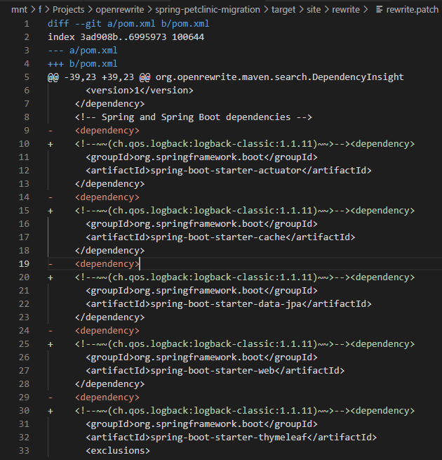

# Automating Maven dependency management

Dependency management is a complex and often frustrating part of software development. Sometimes a transitive dependency you'd never expect makes it onto your runtime classpath. Sometimes your build tool resolves a conflict between requested dependency versions in an unexpected way. Despite the headaches, it wouldn't make sense for most projects to forgo dependencies.

OpenRewrite can help. In this tutorial, we'll learn how to automate common dependency management tasks by migrating a project from one [slf4j](http://www.slf4j.org/) implementation to another.

## Setup

1. Clone our fork of [spring-petclinic](https://github.com/openrewrite/spring-petclinic-migration), or select your own project.
2. Familiarize yourself with the basics of applying the `rewrite-maven-plugin` as described in our [quickstart guide](../getting-started.md).


The sample `spring-petclinic` project is based on an older version of the project that requires a JDK version 1.8 to build. Newer JDK versions will not work. Get OpenJDK 8 [here](https://adoptopenjdk.net/) if you do not already have one.


## Getting Insight into your Dependencies

The first step in changing your dependencies is knowing what they are. Let's find out which of the existing dependencies are using `logback-classic`. There's no mention of `logback` in the `pom.xml` itself, but any of the dependencies that are there could be bringing it in transitively.

Add the `rewrite-maven-plugin` to the `pom.xml`:


```xml
<!-- inside of project/build/plugins -->
<plugin>
    <groupId>org.openrewrite.maven</groupId>
    <artifactId>rewrite-maven-plugin</artifactId>
    <version>5.40.2</version>
    <configuration>
        <activeRecipes>
            <recipe>com.yourorg.LogbackInsight</recipe>
        </activeRecipes>
    </configuration>
</plugin>
```


Then create a `rewrite.yml` file at the project root with these contents:


```yaml
---
type: specs.openrewrite.org/v1beta/recipe
name: com.yourorg.LogbackInsight
displayName: Find Logback Usage
recipeList:
  - org.openrewrite.maven.search.DependencyInsight:
      groupIdPattern: ch.qos.logback
      artifactIdPattern: "*"
      scope: compile
```


Now run `mvn rewrite:dryRun`. This won't make changes to the project's files. It will produce a `rewrite.patch` file in the reports directory, with a link in the console log:


```
These recipes would make changes to pom.xml:
    org.openrewrite.maven.search.DependencyInsight
Report available:
    /mnt/f/Projects/openrewrite/spring-petclinic-migration/target/site/rewrite/rewrite.patch
Run 'mvn rewrite:run' to apply the recipes.
```


Use your preferred diff viewer to inspect the `rewrite.patch` file, which reveals all of the dependencies that transitively depend on `logback`.



At this point, you have all of the information you need to manually exclude `logback-classic` from those other dependencies and add a dependency on your preferred slf4j implementation. But that wouldn't prevent `logback-classic` from being added back in the future. There is an easier, future-proof way to do it.

## Switching SLF4J Implementations

Use the rewrite recipes [ExcludeDependency](/reference/recipes/maven/excludedependency.md) and [AddDependency](/reference/recipes/maven/adddependency.md) to ensure that only your preferred slf4j dependency is used. If a new transitive dependency on `logback-classic` appears in the future, `ExcludeDependency` will detect and exclude it.

Add this to your `rewrite.yml`:


```yaml
---
type: specs.openrewrite.org/v1beta/recipe
name: com.yourorg.UseSlf4jSimple
displayName: Use slf4j Simple
recipeList:
  - org.openrewrite.maven.ExcludeDependency:
      groupId: ch.qos.logback
      artifactId: logback-classic
  - org.openrewrite.maven.AddDependency:
      groupId: org.slf4j
      artifactId: slf4j-simple
      version: 1.7.X
```


And set the `com.yourorg.UseSlf4jSimple` recipe as active in your `pom.xml`:


```xml
<!-- inside of project/build/plugins -->
<plugin>
    <groupId>org.openrewrite.maven</groupId>
    <artifactId>rewrite-maven-plugin</artifactId>
    <version>5.40.2</version>
    <configuration>
        <activeRecipes>
            <recipe>com.yourorg.UseSlf4jSimple</recipe>
        </activeRecipes>
    </configuration>
</plugin>
```


You can now run `mvn rewrite:dryRun` again to preview the changes that will be made and `mvn rewrite:run` to apply the changes.



No explicit version number is added for slf4j-simple because an appropriate version is set by the project's parent pom. `AddDependency` is smart enough not to add the unnecessary version number.


## CI Integration

`mvn rewrite:dryRun` only produces warnings in the console output and a `rewrite.patch` file if there are active recipes that would make changes. This means `dryRun` can be used in your CI pipeline to prevent new `logback-classic` dependencies from being added going forward. Configure the CI step to fail if `dryRun` emits any warnings to the console log, or if a `rewrite.patch` file is produced, and you have an effective guard against regression.

Of course, CI failures are always at least a little bit frustrating for developers. Another option, at least in organizations where the commit is made by CI, is to run `mvn rewrite:run` before the build & test step. Then the build won't need to fail because OpenRewrite will automatically fix the dependency problem.

## Next Steps

The dependency management recipes used in this guide aren't the only such recipes included in rewrite. See the [Maven](automating-maven-dependency-management.md) recipe reference for the full listing of dependency management recipes.
